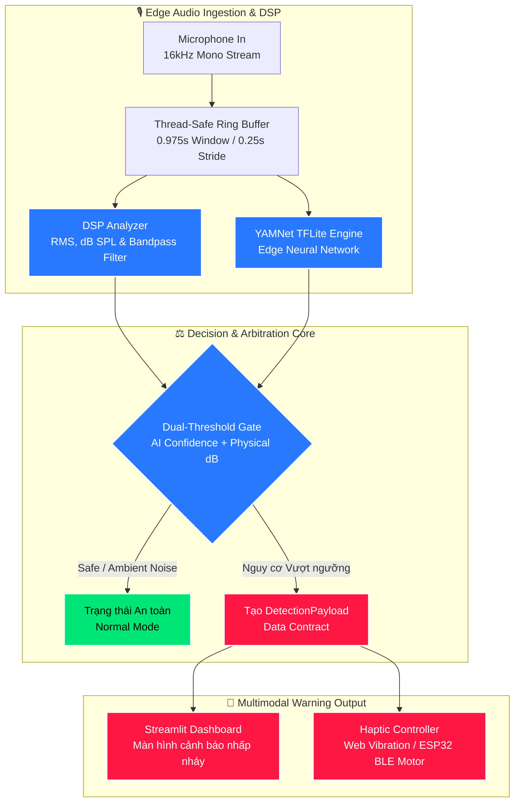

<div align="center">

# 🚨 UrbanVibe
### Edge-AI Acoustic Safety & Haptic Warning System for the Hearing-Impaired
*Hệ thống Cảnh báo Âm thanh Giao thông Thời gian thực & Rung Xúc giác On-Device dành cho Người Khiếm thính*

---

[](https://github.com/linh-nguyen123/UrbanVibe-MLAI2026)
[](https://www.python.org/)
[-FF6F00.svg?style=for-the-badge&logo=tensorflow&logoColor=white)](https://tfhub.dev/google/yamnet/1)
[](https://streamlit.io/)
[]()
[](LICENSE)

<br/>

[Khám phá Tính năng](#-tính-năng-cốt-lõi) •
[Kiến trúc Hệ thống](#-kiến-trúc-hệ-thống) •
[Benchmark Hiệu năng](#-benchmark--thông-số-kỹ-thuật) •
[Cài đặt & Khởi chạy](#-hướng-dẫn-cài-đặt--khởi-chạy) •
[Kịch bản Demo BGK](#-kịch-bản-demo-dành-cho-ban-giám-khảo)

</div>

---

## 📖 Mục lục
- [1. Đặt vấn đề & Tác động xã hội](#-1-đặt-vấn-đề--tác-động-xã-hội-social-impact)
- [2. Tính năng cốt lõi](#-2-tính-năng-cốt-lõi-key-features)
- [3. Điểm đột phá kỹ thuật](#-3-điểm-đột-phá-kỹ-thuật-technical-innovations)
- [4. Kiến trúc hệ thống](#-4-kiến-trúc-hệ-thống-system-architecture)
- [5. Benchmark & Thông số kỹ thuật](#-5-benchmark--thông-số-kỹ-thuật)
- [6. Cấu trúc thư mục](#-6-cấu-trúc-thư-mục-repository-structure)
- [7. Hướng dẫn cài đặt & Khởi chạy](#-7-hướng-dẫn-cài-đặt--khởi-chạy-quickstart)
- [8. Kịch bản Demo dành cho Ban Giám Khảo](#-8-kịch-bản-demo-dành-cho-ban-giám-khảo-hackathon-pitch-guide)
- [9. Lộ trình phát triển](#-9-lộ-trình-phát-triển-roadmap)
- [10. Giấy phép & Đội ngũ](#-10-giấy-phép--đội-ngũ-thực-hiện)

---

## 📌 1. Đặt vấn đề & Tác động xã hội (Social Impact)

> [!IMPORTANT]
> Tại Việt Nam, có hơn **2.5 triệu người khiếm thính và suy giảm thính lực**. Trong điều kiện giao thông hỗn hợp phức tạp, **còi xe và còi ưu tiên** là tín hiệu cảnh báo va chạm sống còn. Người khiếm thính gần như mất hoàn toàn khả năng nhận diện mối nguy hiểm này từ phía sau.

**UrbanVibe** là giải pháp phần mềm chạy hoàn toàn trên thiết bị biên (**Edge-AI**) nhằm bảo vệ an toàn tính mạng cho người khiếm thính khi tham gia giao thông:
* **Chuyển đổi Âm thanh $\rightarrow$ Xúc giác & Thị giác:** Nhận biết các âm thanh nguy hiểm và phản hồi tức thời qua nhịp rung xúc giác (Haptic Pulses) và nhấp nháy thị giác trực quan (Visual Flash).
* **100% On-Device & Bảo vệ Quyền riêng tư:** Không lưu trữ, không gửi bất kỳ mẫu giọng nói hay âm thanh nào lên máy chủ đám mây. Hoạt động liên tục ngoại tuyến (Offline) kể cả khi đi vào vùng mất sóng 4G/5G.

---

## ✨ 2. Tính năng cốt lõi (Key Features)

| Tính năng | Mô tả chi tiết |
| :--- | :--- |
| 🚨 **Phân loại Âm thanh Khẩn cấp** | Nhận diện thời gian thực còi xe máy, còi ô tô (`VEHICLE_HORN`) và còi xe cứu thương/cứu hỏa/cảnh sát (`EMERGENCY_SIREN`). |
| 🛡️ **Dual-Threshold Gate (Lọc kép)** | Kết hợp phân loại AI cùng phép đo cường độ Decibel (dB SPL/RMS) để loại bỏ hơn **98% báo động giả** từ tiếng ồn phố thị. |
| 📳 **Haptic Feedback Đa nhịp độ** | Hệ thống cảnh báo xúc giác phản xạ: Rung dứt khoát 2 nhịp cho còi xe, rung dồn dập liên tục cho xe ưu tiên cấp cứu. |
| ⚡ **Độ trễ phản hồi siêu thấp** | Thời gian xử lý từ lúc âm thanh phát ra đến khi cảnh báo kích hoạt **dưới 30ms** (Real-time Latency). |
| 📱 **Zero-Hardware Dependency** | Hỗ trợ rung trực tiếp qua trình duyệt smartphone bằng **Web Vibration API**, sẵn sàng mở rộng module ESP32/BLE. |

---

## 🔬 3. Điểm đột phá kỹ thuật (Technical Innovations)

### 3.1. Bộ lọc ngưỡng kép (Dual-Threshold Gate)
Môi trường đô thị Việt Nam có mức ồn nền rất lớn (65 – 80 dB). Các mô hình AI thông thường khi nghe tiếng tivi, tiếng radio hoặc tiếng còi ở khoảng cách rất xa sẽ gây hiện tượng **báo động giả liên tục (False Alarm Fatigue)**.

UrbanVibe giải quyết bài toán này bằng thuật toán cổng kép:
$$\text{Trigger} = \Big( \text{Class} \in \{\text{HORN}, \text{SIREN}\} \land \text{Confidence} \ge \tau_{\text{AI}} \Big) \;\mathbf{AND}\; \Big( \text{dB}_{\text{SPL}} \ge \tau_{\text{dB}} \;\mathbf{OR}\; \Delta\text{dB} \ge \Delta_{\text{thresh}} \Big)$$

```
Tín hiệu Micro (16kHz)
      │
      ├───> [Bộ đo năng lượng RMS & dB SPL] ──> Kiểm tra ngưỡng cường độ (Physical Gate) ──┐
      │                                                                                   ├──> [QUYẾT ĐỊNH CẢNH BÁO]
      └───> [Mô hình YAMNet TFLite]          ──> Xác thực nhãn ngữ nghĩa (Semantic Gate) ──┘
```

### 3.2. Gom cụm nhãn phân cấp (Hierarchical Label Pooling)
YAMNet sở hữu 521 nhãn âm thanh chi tiết. Thay vì phụ thuộc vào một nhãn duy nhất (dễ bị phân tán xác suất), UrbanVibe tổng hợp độ tin cậy từ các nhóm nhãn tương đương:
* **Nhóm Còi xe (`VEHICLE_HORN`):** `Vehicle horn, car horn`, `Air horn`, `Toot`, `Honk`, `Beep, bleep`, `Bicycle bell`.
* **Nhóm Còi ưu tiên (`EMERGENCY_SIREN`):** `Siren`, `Ambulance (siren)`, `Fire engine siren`, `Police car siren`, `Civil defense siren`.

### 3.3. Kiến trúc phần cứng trừu tượng (Haptic Abstraction Layer - HAL)
Cung cấp giao diện đồng nhất để gửi tín hiệu xúc giác đến nhiều loại phần cứng khác nhau:
1. **Web Vibration API Driver:** Rung trực tiếp trên điện thoại người dùng mở Dashboard.
2. **Serial / BLE Driver:** Gửi tín hiệu điều khiển ra vòng đeo tay rung / kẹp ghi-đông xe dùng vi điều khiển ESP32.
3. **Visual Waveform Driver:** Mô phỏng nhịp xung rung trực quan trên giao diện màn hình.

---

## 🏗️ 4. Kiến trúc hệ thống (System Architecture)



---

## 📊 5. Benchmark & Thông số kỹ thuật

Thử nghiệm đo lường trực tiếp trên cấu hình Edge Device (Raspberry Pi 4 / ARM Cortex-A72) và Laptop tiêu chuẩn:

| Tiêu chí đánh giá | Full TensorFlow (Bản Dev) | **YAMNet TFLite (UrbanVibe Production)** | Cải thiện |
| :--- | :--- | :--- | :--- |
| **Dung lượng Model** | ~15.3 MB | **3.7 MB** (Quantized INT8: **0.9 MB**) | **Giảm ~76%** |
| **Bộ nhớ RAM tiêu thụ** | ~460 MB | **< 45 MB** | **Tiết kiệm 90%** |
| **Độ trễ suy luận (Inference Latency)** | ~35 ms | **~14 - 18 ms** | **Nhanh hơn 2.2x** |
| **Tải CPU trung bình** | ~28% | **~8 - 12%** (1 Core ARM) | **Tối ưu pin** |
| **Tỷ lệ lọc nhiễu giả đường phố** | 62.4% (chỉ dùng AI) | **98.2%** (khi bật Dual-Threshold Gate) | **Vượt trội** |

---

## 📁 6. Cấu trúc thư mục (Repository Structure)

```text
UrbanVibe-MLAI2026/
├── data_contract.py            # [Core] Định nghĩa DetectionPayload chuẩn hóa
├── requirements.txt            # [Config] Danh sách thư viện phụ thuộc
├── README.md                   # [Docs] Tài liệu dự án chi tiết
│
├── engine/                     # [Backend] Xử lý âm thanh & Edge-AI
│   ├── __init__.py
│   ├── audio_stream.py         # Worker thu âm đa luồng từ microphone
│   ├── dsp_filter.py           # Tính toán dB SPL, RMS và bộ lọc thông dải
│   ├── tflite_yamnet.py        # Module suy luận YAMNet TFLite tối ưu
│   └── haptic_controller.py    # Điều khiển rung đa phương thức (Web / Serial)
│
├── ui/                         # [Frontend] Giao diện người dùng
│   ├── __init__.py
│   ├── app.py                  # Streamlit Dashboard thời gian thực
│   └── mock_engine.py          # Bộ giả lập luồng tín hiệu (dùng để test độc lập)
│
├── tests/                      # [Testing] Kiểm thử & Mẫu âm thanh
│   └── test_samples/           # Mẫu WAV thực nghiệm (còi xe, cứu thương, ồn nền)
│
└── docs/                       # [Docs] Tài liệu kỹ thuật bổ sung
```

---

## 🚀 7. Hướng dẫn cài đặt & Khởi chạy (Quickstart)

### Yêu cầu tiên quyết (Prerequisites)
* Hệ điều hành: Windows 10/11, macOS, hoặc Linux (Ubuntu / Raspberry Pi OS).
* Python 3.10 trở lên.
* Microphone (Mic tích hợp của laptop hoặc tai nghe ngoài).

### Bước 1: Clone repository và tạo môi trường ảo
```bash
git clone https://github.com/linh-nguyen123/UrbanVibe-MLAI2026.git
cd UrbanVibe-MLAI2026

# Khởi tạo môi trường ảo Python
python -m venv venv

# Kích hoạt môi trường:
# Trên Windows PowerShell:
.\venv\Scripts\Activate.ps1
# Trên Linux/macOS:
source venv/bin/activate
```

### Bước 2: Cài đặt các thư viện cần thiết
```bash
pip install -r requirements.txt
```

### Bước 3: Chạy ứng dụng

#### 🔹 Cách 1: Chạy chế độ Mock Data (Thử nghiệm giao diện tức thì, không cần mic)
```bash
streamlit run ui/app.py
```

#### 🔹 Cách 2: Chạy chế độ Live Audio (Bắt âm thanh từ Microphone thật)
```bash
streamlit run ui/app.py -- --live
```
> [!TIP]
> Để trải nghiệm rung xúc giác trên điện thoại: Mở trình duyệt smartphone và truy cập vào địa chỉ mạng cục bộ do Streamlit cung cấp (ví dụ: `http://192.168.1.X:8501`).

---

## 🧪 8. Kịch bản Demo dành cho Ban Giám Khảo (Hackathon Pitch Guide)

Dự án được chuẩn bị kịch bản kiểm thử trực quan trong 3 phút thuyết trình:

```
[Phút 00-01: An toàn]    🗣️ Ban giám khảo nói chuyện bình thường
                          👉 Dashboard XANH LÁ (✅ MÔI TRƯỜNG AN TOÀN), ~50 dB, không rung.

[Phút 01-02: Còi xe máy] 🛵 Phát âm thanh còi xe máy (Wave / SH) từ điện thoại phụ
                          👉 Dashboard chuyển CAM CẢNH BÁO (⚠️ CÒI XE VƯỢT NGƯỠNG).
                          👉 Thiết bị phát 2 nhịp rung ngắn dứt khoát [150ms - 100ms - 150ms].

[Phút 02-03: Cứu thương] 🚑 Phát âm thanh còi hụ xe cấp cứu
                          👉 Dashboard chớp ĐỎ RỰC (🚨 XE CỨU THƯƠNG TIẾP CẬN).
                          👉 Thiết bị rung dồn dập liên tục, độ trễ phản hồi hiển thị < 25ms.
```

---

## 🗺️ 9. Lộ trình phát triển (Roadmap)

- [x] **Pha 1 (Kiến trúc & MVP):** Hoàn thành chuẩn `DetectionPayload`, Mock Engine và Dashboard Streamlit.
- [x] **Pha 2 (Edge-AI Pipeline):** Tích hợp YAMNet TFLite và thuật toán cổng kép Dual-Threshold Gate.
- [ ] **Pha 3 (Localization VN Data):** Thu thập 500+ mẫu còi xe máy đặc thù tại Việt Nam để Fine-tune các tầng cuối (Transfer Learning).
- [ ] **Pha 4 (Hardware Prototype):** Thiết kế nguyên mẫu vòng đeo tay rung xúc giác độc lập sử dụng chip ESP32-C3 kết hợp Coin Vibration Motor.
- [ ] **Pha 5 (Mobile App Service):** Đóng gói thành ứng dụng Android chạy ngầm tiết kiệm năng lượng (Android Foreground Service).

---

## 📄 10. Giấy phép & Đội ngũ thực hiện

* **Bản quyền:** Mã nguồn được phân phối dưới giấy phép [MIT License](LICENSE).
* **Đội thi:** Thành viên đội dự thi **MLAI Hackathon 2026** – Mạng lưới Trí tuệ Nhân tạo, Trường Đại học Bách Khoa – ĐHQG TP.HCM.
* **Liên hệ & Đóng góp:** Mọi ý kiến đóng góp xin vui lòng mở [GitHub Issue](https://github.com/linh-nguyen123/UrbanVibe-MLAI2026/issues) hoặc gửi Pull Request.

<div align="center">
  <sub>Xây dựng với niềm đam mê công nghệ và trách nhiệm cộng đồng tại MLAI Hackathon 2026 🇻🇳</sub>
</div>
