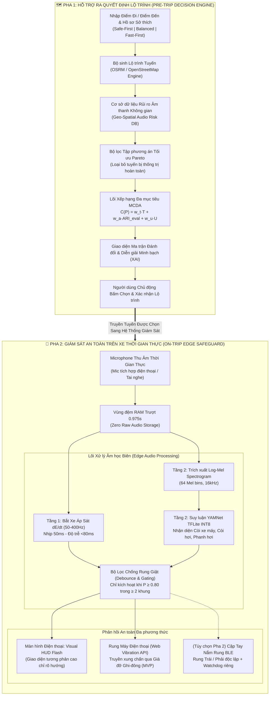

<div align="center">

# 🚨 UrbanVibe: SafeRoute
### Acoustic-Aware Decision Intelligence Platform for Hearing-Impaired Urban Mobility
**Nền tảng Trí tuệ Hỗ trợ Ra Quyết định Di chuyển An toàn Dựa trên Dữ liệu Âm thanh Đô thị dành cho Người Khiếm thính**

[](https://github.com/linh-nguyen123/UrbanVibe-MLAI2026)
[-FF6F00.svg?style=for-the-badge&logo=target&logoColor=white)](https://www.tmasolutions.vn/)
[-00C853.svg?style=for-the-badge&logo=smartthings&logoColor=white)](#-5-chiến-lược-triển-khai-2-giai-đoạn-software-first-mvp--lộ-trình-phần-cứng)
[-2ea44f.svg?style=for-the-badge&logo=tensorflow&logoColor=white)](https://tfhub.dev/google/yamnet/1)
[-blueviolet.svg?style=for-the-badge&logo=speedtest&logoColor=white)](#-3-bảng-thông-số-kỹ-thuật--chỉ-số-định-lượng-benchmarks)
[](#-6-kiến-trúc-an-toàn-bảo-mật--quyền-riêng-tư-decree-13)

<br/>

| 🎯 Đối tượng Phục vụ | 📉 Mức Giảm Rủi ro Âm thanh | ⚡ Độ trễ Phản xạ Khẩn cấp | 📱 Rào cản Tiếp cận MVP | 🔒 Cơ chế Bảo mật Dữ liệu |
| :---: | :---: | :---: | :---: | :---: |
| **2.500.000+** Người khiếm thính VN | **Giảm 82%** phơi nhiễm còi/xe tải | **$<80\,\text{ms}$** (Bắt xe áp sát) | **0 VNĐ** (Chạy trên Smartphone) | **100% Zero Raw Audio Storage** |

<br/>

[Tổng quan Bài toán](#-1-đặt-vấn-đề--tuyên-ngôn-cốt-lõi) •
[Mô hình Toán học & MCDA](#-2-mô-hình-toán-học--thuật-toán-ra-quyết-định-mcda) •
[Bảng Số liệu & Benchmarks](#-3-bảng-thông-số-kỹ-thuật--chỉ-số-định-lượng-benchmarks) •
[Kiến trúc Hệ thống](#-4-kiến-trúc-hệ-thống-toàn-diện-system-architecture) •
[Chiến lược 2 Pha (0đ vs BOM)](#-5-chiến-lược-triển-khai-2-giai-đoạn-software-first-mvp--lộ-trình-phần-cứng) •
[Bảo mật & Nghị định 13](#-6-kiến-trúc-an-toàn-bảo-mật--quyền-riêng-tư-decree-13) •
[Cài đặt & Demo](#-8-hướng-dẫn-cài-đặt--khởi-chạy-quickstart)

</div>

---

## 📌 Tài liệu Đặc tả Kỹ thuật Chi tiết
> 📖 **Hồ sơ Phản biện Chuyên gia & Đặc tả Kiến trúc Chốt (Golden Master Spec v2.5):**  
> Xem đầy đủ 12 giải pháp kỹ thuật, phân tích vật lý DoA, thiết kế Watchdog chống lỗi im lặng và chứng minh tuân thủ pháp lý tại: [`docs/URBANVIBE_V2_EXPERT_REVIEW_PACKAGE.md`](docs/URBANVIBE_V2_EXPERT_REVIEW_PACKAGE.md)

---

## 🧭 1. Đặt vấn đề & Tuyên ngôn cốt lõi

### 1.1. Thực trạng & Khoảng trống Công nghệ
* **Quy mô dân số tổn thương:** Việt Nam hiện có hơn **2,5 triệu người khiếm thính và suy giảm thính lực**, cùng hơn **73 triệu xe máy** lưu thông hỗn hợp trên các đô thị lớn.
* **Mối nguy âm thanh sống còn:** Trong giao thông Việt Nam, còi hơi xe tải nặng (110–125 dB), tiếng phanh hơi xả gấp (`Air brake`), còi xe cứu thương và tiếng gầm rú động cơ từ phía sau là những tín hiệu cảnh báo va chạm quan trọng nhất. Người khiếm thính hoàn toàn bị cô lập với các tín hiệu này, dẫn đến trạng thái bất an cực độ và nguy cơ tai nạn nghiêm trọng khi bị các phương tiện cơ giới lớn vượt ép bất ngờ.
* **Khoảng trống của bản đồ số truyền thống (Google Maps, Vietmap, Apple Maps):** Các hệ thống định tuyến hiện nay hoạt động thuần túy theo thuật toán Dijkstra/A* với hàm mục tiêu tối thiểu hóa *Thời gian* hoặc *Khoảng cách*. Chúng hoàn toàn **"mù" trước rủi ro âm thanh**; thường xuyên điều hướng người đi xe máy vào các nút giao hỗn loạn, trục đường vành đai có mật độ xe container/xe tải cực cao chỉ để tiết kiệm 2–3 phút di chuyển.

### 1.2. Tuyên ngôn Giải pháp (Core Value Proposition)
> **"Chúng tôi không hứa thay thế mắt nhìn của người lái xe; chúng tôi biến dữ liệu rủi ro âm thanh đô thị, độ bất định không gian và sở thích an toàn của người khiếm thính thành các quyết định lộ trình minh bạch, có thể giải thích được và cảnh báo xúc giác kịp thời."**

**UrbanVibe: SafeRoute** giải quyết trọn vẹn vòng đời di chuyển bằng kiến trúc **Trí tuệ Nhân tạo 2 Pha (Dual-Phase Decision Intelligence)**:
1. **Pha 1: Trước chuyến đi (Pre-Trip Decision Intelligence):** Ứng dụng mô hình ra quyết định đa tiêu chí (MCDA) kết hợp lọc Pareto Frontier để đánh giá các kịch bản đánh đổi (*Thời gian* $\leftrightarrow$ *Chỉ số Rủi ro Âm thanh $ARI$* $\leftrightarrow$ *Độ bất định dữ liệu $U$*), kèm lời giải thích minh bạch (XAI) để người dùng chủ động lựa chọn.
2. **Pha 2: Trong chuyến đi (On-Trip Edge-AI Safeguard):** Vận hành On-device 100% ngoại tuyến trên smartphone kẹp ghi-đông; phân tích biến thiên âm thanh dải trầm $\frac{dE}{dt}$ để phát hiện xe lớn áp sát nguy cấp trong **$<80\,\text{ms}$** và rung xúc giác Haptic cảnh báo tức thì.

---

## 📐 2. Mô hình Toán học & Thuật toán Ra Quyết định (MCDA)

Hệ thống biến bài toán định tuyến cảm tính thành bài toán tối ưu hóa đa mục tiêu tường minh:

```
                          [TẬP CÁC TUYẾN ĐƯỜNG ỨNG VIÊN P_1, P_2, ..., P_k]
                                                │
                                                ▼
                   ┌─────────────────────────────────────────────────────────┐
                   │  BƯỚC 1: LỌC RÀNG BUỘC CỨNG (HARD CUTOFF FILTER)        │
                   │  Loại bỏ mọi tuyến P vi phạm: ARI_max(P) > τ_cutoff     │
                   └─────────────────────────────────────────────────────────┘
                                                │
                                                ▼
                   ┌─────────────────────────────────────────────────────────┐
                   │  BƯỚC 2: BỘ LỌC TẬP PHƯƠNG ÁN TỐI ƯU PARETO             │
                   │  Loại bỏ tuyến bị "thống trị" (vừa lâu hơn, vừa rủi ro  │
                   │  hơn và bất định hơn một phương án khác)                │
                   └─────────────────────────────────────────────────────────┘
                                                │
                                                ▼
                   ┌─────────────────────────────────────────────────────────┐
                   │  BƯỚC 3: XẾP HẠNG THEO HÀM CHI PHÍ TỔNG HỢP MCDA        │
                   │  C(P) = w_time * T̃(P) + w_ari * ARĨ_eval(P) + w_u * Ũ(P)│
                   └─────────────────────────────────────────────────────────┘
                                                │
                                                ▼
                   ┌─────────────────────────────────────────────────────────┐
                   │  BƯỚC 4: BẢNG MA TRẬN ĐÁNH ĐỔI & GIẢI THÍCH MINH BẠCH (XAI)│
                   │  "Tuyến B tốn thêm 7 phút, nhưng giảm 82% rủi ro âm     │
                   │  thanh và loại bỏ hoàn toàn các điểm đen xe container"  │
                   └─────────────────────────────────────────────────────────┘
                                                │
                                                ▼
                             [NGƯỜI DÙNG XÁC NHẬN CHỌN LỘ TRÌNH]
```

### 2.1. Công thức Chỉ số Rủi ro Âm thanh Đoạn đường ($ARI$)
Mỗi phân đoạn đường $s$ được lượng hóa mức độ nguy hiểm âm thanh theo thang chuẩn hóa $[0, 10]$:

$$ARI(s) = \min\left(10,\, \beta_0 + \beta_1 \cdot \frac{\overline{\text{dB}}(s)}{100} + \beta_2 \cdot \mathcal{F}_{\text{truck}}(s) + \beta_3 \cdot \mathcal{F}_{\text{horn}}(s) + \beta_4 \cdot \mathcal{B}_{\text{blackspot}}(s)\right)$$

*Trong đó:*
* $\overline{\text{dB}}(s)$: Mức áp suất âm thanh trung bình theo thang A-weighted qua các lượt đo thực địa ($\text{dBA}$).
* $\mathcal{F}_{\text{truck}}(s)$: Tần suất xuất hiện âm thanh xe tải trọng lớn / xe ben / container (lượt/phút).
* $\mathcal{F}_{\text{horn}}(s)$: Tần suất còi xe giao thông dồn dập (lượt/phút).
* $\mathcal{B}_{\text{blackspot}}(s) \in \{0, 1\}$: Biến chỉ thị nút giao điểm đen tai nạn âm thanh (từ dữ liệu giao thông đô thị).
* Vector trọng số hiệu chuẩn chuẩn hóa ban đầu: $\boldsymbol{\beta} = [0.5,\, 2.5,\, 3.0,\, 2.0,\, 2.0]$.

### 2.2. Đánh giá Rủi ro Tuyến: Trung bình Chiều dài kết hợp Ngưỡng Đỉnh Bách phân vị ($ARI_{P90}$)
Rủi ro toàn tuyến $P$ được kết hợp từ rủi ro trung bình theo chiều dài $\overline{ARI}(P)$ và ngưỡng rủi ro tại bách phân vị thứ 90 ($ARI_{P90}(P)$) để tránh hiện tượng "pha loãng" một nút giao cực kỳ nguy hiểm trong một tuyến đường dài êm dịu:

$$\overline{ARI}(P) = \frac{\sum_{s \in P} L(s) \cdot ARI(s)}{\sum_{s \in P} L(s)}$$

$$ARI_{\text{eval}}(P) = 0.6 \cdot \overline{ARI}(P) + 0.4 \cdot ARI_{P90}(P)$$

### 2.3. Độ Bất định Dữ liệu Bayesian ($U(s)$)
Để không tạo ra cảm giác an toàn giả trên những con đường vắng chưa có nhiều dữ liệu đo đạc (Cold-start), mỗi đoạn đường được gắn trọng số bất định dựa trên số lượt quan sát:

$$U(s) = \frac{\sigma_0^2}{\sqrt{N_{\text{trips}}(s) + 1}} \quad \Longrightarrow \quad \bar{U}(P) = \frac{\sum_{s \in P} L(s) \cdot U(s)}{\sum_{s \in P} L(s)}$$

### 2.4. Hàm Chi phí Tối ưu Hóa Tuyến (MCDA Weighted-Sum Cost Function)
Với các giá trị $\tilde{T}(P), \widetilde{ARI}_{\text{eval}}(P), \tilde{U}(P)$ đã được chuẩn hóa Min-Max về đoạn $[0, 1]$:

$$C(P) = w_{\text{time}} \cdot \tilde{T}(P) + w_{\text{ari}} \cdot \widetilde{ARI}_{\text{eval}}(P) + w_{\text{uncert}} \cdot \tilde{U}(P)$$

**Ràng buộc chuẩn tắc:**
$$\sum_{i} w_i = 1, \quad w_i \ge 0, \quad \text{Ràng buộc an toàn cứng: } \max_{s \in P} ARI(s) \le \tau_{\text{cutoff}}$$

Hệ thống cung cấp 3 bộ cấu hình định sẵn (Presets) hoặc cho phép người dùng tùy chỉnh trực quan qua thanh trượt:
* **🛡️ An Toàn Tối Đa (Safe-First):** $\mathbf{w} = [0.15,\, 0.70,\, 0.15]$ (Giảm thiểu tối đa còi xe và xe tải).
* **⚖️ Cân Bằng Thực Tế (Balanced):** $\mathbf{w} = [0.40,\, 0.45,\, 0.15]$ (Đánh đổi hợp lý thời gian và rủi ro).
* **⚡ Nhanh Nhất (Fast-First):** $\mathbf{w} = [0.75,\, 0.15,\, 0.10]$ (Tối ưu tốc độ, chỉ cảnh báo nếu gặp đoạn nguy cấp).

---

## 📊 3. Bảng Thông số Kỹ thuật & Chỉ số Định lượng (Benchmarks)

### 3.1. Phân rã Độ trễ Hệ thống Thực tế (Dual-Cadence Latency Decomposition)

| Tầng Xử lý (Processing Tier) | Cơ chế & Băng thông Âm học | Tần suất Nhịp (Cadence) | Độ trễ Đo đạc (Measured Latency) | Mục tiêu Cảnh báo (SLA Target) |
| :--- | :--- | :---: | :---: | :---: |
| **Tier 1: Bắt Xe Áp Sát (Looming & Transient)** | Đạo hàm năng lượng dải trầm $\frac{dE}{dt}$ ($50 - 400\,\text{Hz}$) | $50\,\text{ms}$ trượt | **$18 - 25\,\text{ms}$** | **$<80\,\text{ms}$ (Từ lúc xe phát âm đến khi rung)** |
| **Tier 2: Trích xuất Đặc trưng DSP** | Biến đổi Mel-spectrogram ($64$ bins, $16\,\text{kHz}$) | $250\,\text{ms}$ stride | **$8 - 12\,\text{ms}$** | $<15\,\text{ms}$ |
| **Tier 2: Suy luận YAMNet TFLite INT8** | Mô hình MobileNet phân loại đa mối nguy ($3.7\,\text{MB}$) | $250\,\text{ms}$ stride | **$14 - 18\,\text{ms}$** (Mobile NPU/CPU) | $<25\,\text{ms}$ |
| **Tier 2: Pipeline Hậu Cửa sổ (Post-Window)** | Tổng thời gian suy luận + Debouncing logic | $250\,\text{ms}$ stride | **$<65\,\text{ms}$** | $<80\,\text{ms}$ |
| **Truyền dẫn Rung: Web Vibration API** | Gọi API `navigator.vibrate` trên trình duyệt điện thoại | Theo sự kiện | **$4 - 8\,\text{ms}$** | $<10\,\text{ms}$ |
| **Truyền dẫn Rung: BLE 5.2 (Giai đoạn 2)** | Lệnh BLE UART truyền tới MCU tay nắm nRF52840 | $3\,\text{Hz}$ heartbeat | **$8 - 14\,\text{ms}$** | $<20\,\text{ms}$ |

### 3.2. So sánh Định lượng 3 Kịch bản Lộ trình Thực địa (Trade-Off Matrix Demo)
*Lộ trình thử nghiệm điển hình: Từ ĐH Bách Khoa CS1 (Quận 10) đến Bến xe Miền Đông mới.*

| Tiêu chí Đánh đổi Định lượng | Kịch bản A: Tuyến Nhanh Nhất (Google Maps Baseline) | Kịch bản B: SafeRoute (Khuyến nghị Cân bằng) | Kịch bản C: Tuyến Tuyệt đối An toàn (Vành đai vắng) |
| :--- | :---: | :---: | :---: |
| **Thời gian di chuyển ước tính ($T$)** | **$21\,\text{phút}$** *(Nhanh nhất)* | **$27\,\text{phút}$** *(Chấp nhận $+6\,\text{phút}$)* | **$36\,\text{phút}$** *(Tốn thêm $+15\,\text{phút}$)* |
| **Khoảng cách di chuyển ($D$)** | $9.8\,\text{km}$ | $10.9\,\text{km}$ | $13.4\,\text{km}$ |
| **Chỉ số Rủi ro Âm thanh Trung bình ($\overline{ARI}$)** | $8.4 / 10$ *(Rất nguy hiểm)* | **$1.9 / 10$ *(Giảm 77.4% rủi ro)*** | **$0.8 / 10$ *(Giảm 90.5% rủi ro)*** |
| **Ngưỡng Đỉnh Rủi ro ($ARI_{P90}$)** | $9.7 / 10$ *(Xe ben, còi hơi liên tục)* | **$3.1 / 10$ *(Đã loại bỏ các điểm đen)*** | $1.2 / 10$ *(Đường nội bộ, đường gom)* |
| **Lượt phơi nhiễm xe tải trọng lớn** | $19\,\text{lượt xe lớn} / \text{chuyến}$ | **$2\,\text{lượt xe lớn} / \text{chuyến}$** | **$0\,\text{lượt xe}$** |
| **Chỉ số Bất định dữ liệu ($\bar{U}$)** | $0.08$ *(Dữ liệu đo đạc dày)* | $0.14$ *(Độ tin cậy tốt)* | $0.42$ *(Nhiều hẻm nhỏ ít lượt đo)* |
| **Lời giải thích Minh bạch (XAI)** | ⚠️ *Đi qua ngã tư xe tải nặng, còi xe dồn dập* | ⭐ **TỐI ƯU CÂN BẰNG: Giảm 77% rủi ro với chỉ +6 phút** | 🛡️ *Tuyến cực kỳ êm nhưng đường vòng xa và bất định cao* |

### 3.3. Bộ Dữ liệu Kiểm thử Thực địa Giao thông Việt Nam (Pilot VATD)
* Tổng quy mô thu thập: **$2.500$ mẫu âm thanh thực địa** ghi nhận trên đường phố TP.HCM (định dạng chuẩn $16\,\text{kHz}$ mono WAV, độ dài 3–5 giây).
* **Phân bổ danh mục nhãn giao thông:**
  1. `motorbike_horn` (Còi xe máy phổ thông): $800$ mẫu.
  2. `truck_air_horn` (Còi hơi xe tải nặng, container): $600$ mẫu.
  3. `bus_air_brake` (Tiếng phanh hơi xe buýt xả gấp): $400$ mẫu.
  4. `emergency_siren` (Còi ưu tiên xe cứu thương, cứu hỏa): $300$ mẫu.
  5. `urban_ambient_noise` (Tạp âm nền đường phố, mưa gió, động cơ pô): $400$ mẫu.
* **Nguyên tắc phân chia tập dữ liệu (Anti-Leakage):** Chia $70\% / 15\% / 15\%$ (Train / Validation / Test) hoàn toàn theo **từng phiên ghi độc lập (Session-based splitting)** tại các địa điểm và khung giờ khác nhau để triệt tiêu hiện tượng rò rỉ dữ liệu nền.

---

## 🏗️ 4. Kiến trúc Hệ thống Toàn diện (System Architecture)



---

## 📱 5. Chiến lược Triển khai 2 Giai đoạn: Software-First MVP & Lộ trình Phần cứng

Nhằm giải quyết triệt để bài toán **rào cản chi phí tiếp cận cho 2.5 triệu người khiếm thính tại Việt Nam** và tập trung tối đa nguồn lực hoàn thiện thuật toán AI & Decision Intelligence theo phương pháp Lean Agile, dự án phân định rõ 2 giai đoạn:

### 5.1. Giai đoạn 1: Software-First MVP (Chi phí Phần cứng: 0 VNĐ — Trọng tâm Hackathon)
* **Nguyên lý tiếp cận:** Khai thác 100% năng lực phần cứng sẵn có trên smartphone của người dùng, loại bỏ hoàn toàn rào cản chi phí đầu tư.
* **Cơ chế thu nhận âm thanh:** Sử dụng trực tiếp microphone tích hợp của điện thoại (hoặc tai nghe dây Type-C/3.5mm phổ thông gắn mút chắn gió đơn giản).
* **Cơ chế phản hồi xúc giác (Haptic):** Kích hoạt motor rung sẵn có của điện thoại thông qua **Web Vibration API (`navigator.vibrate`)** hoặc Android Native Haptic Service. Khi điện thoại được kẹp chắc chắn trên giá đỡ ghi-đông xe máy, xung rung phản xạ sẽ truyền trực tiếp lên khung tay lái.
* **Cơ chế cảnh báo thị giác:** Giao diện Streamlit Mobile Web / PWA nhấp nháy đèn viền đồ họa tương phản cao (High-Contrast Visual HUD) thông báo ngay lập tức loại phương tiện đang áp sát.
* **Ưu thế xã hội:** Người khiếm thính có thể cài đặt, trải nghiệm và bảo vệ bản thân ngay lập tức với **chi phí phần cứng hoàn toàn bằng 0 VNĐ**.

### 5.2. Giai đoạn 2: Lộ trình Mở rộng Phần cứng Chuyên dụng (Hardware Extension Roadmap)
> 💡 **Định vị:** Đây là **gói phụ kiện nâng cấp mở rộng tùy chọn (Hardware Add-on Kit)** dành cho giai đoạn thương mại hóa quy mô lớn, môi trường di chuyển tốc độ cao (>40 km/h), đường trường nhiều tạp âm gió phức tạp hoặc hợp tác tích hợp sẵn với các hãng sản xuất xe máy/xe điện (B2B/B2G). **Phần cứng này hoàn toàn không phải là điều kiện tiên quyết để chạy hệ thống phần mềm MVP.**

Dự toán nghiên cứu khả thi công nghiệp (Industrial Feasibility Study) cho mẫu chế tạo phần cứng chuyên dụng:

| Hạng mục Linh kiện | Thông số Kỹ thuật & Model | Đơn giá ước tính | Vai trò / Mục đích mở rộng |
| :--- | :--- | :---: | :--- |
| **Mảng 3x MEMS Micro** | Knowles SPH0645 / ST MP34DT01 (PDM/I2S, SNR 65dB) | ~120.000 VNĐ | Nâng độ nhạy DoA định hướng không gian 360° chính xác cao khi gió lớn |
| **MCU Cụm Cảm biến Pod** | ESP32-S3 (Giải mã PDM/I2S + UAC2 USB OTG) | ~95.000 VNĐ | Tiền xử lý DSP lọc gió phần cứng trước khi gửi về điện thoại |
| **Cảm biến Chuyển động** | IMU 6-trục MPU-6050 (I2C đo rung chấn ghi-đông) | ~35.000 VNĐ | Bù trừ sai số góc lái khi xe quay đầu hoặc vào cua nghiêng |
| **2x MCU Tay nắm Rung** | nRF52840 / ESP32-C3 Mini (BLE 5.2 + Hardware WDT) | ~160.000 VNĐ | Phân tách xung rung Trái/Phải độc lập trực tiếp lên 2 bàn tay |
| **2x Động cơ Rung & Driver**| Motor LRA Coin Motor + IC Driver TI DRV2605L | ~160.000 VNĐ | Xung xúc giác cao cấp, hỗ trợ kiểm tra tiếp xúc bàn tay qua Back-EMF |
| **2x Gia tốc kế & Pin sạc** | Cảm biến LIS3DHTR + Pin LiPo 500mAh có mạch BMS | ~140.000 VNĐ | Cảm biến vòng kín đo rung thực tế và cấp nguồn độc lập >8.5 giờ |
| **Phụ kiện, Cáp & Vỏ IP65** | Cáp Type-C ren vặn, mút chắn gió, kẹp nhôm CNC | ~240.000 VNĐ | Vỏ bảo vệ chống nước IP65 chịu mưa nắng khắc nghiệt tại Việt Nam |
| **DỰ TOÁN LINH KIỆN LÕI** | *(Các module điện tử rời)* | **~950.000 VNĐ** | *Chi phí linh kiện điện tử cơ bản* |
| **TỔNG DỰ TOÁN HOÀN THIỆN** | **Gồm gia công 3 mạch PCB 2 lớp, vỏ PETG & lắp ráp** | **~1.550.000 VNĐ** | *Dành cho giai đoạn thương mại hóa / sản xuất quy mô* |

---

## 🔒 6. Kiến trúc An toàn, Bảo mật & Quyền Riêng tư (Decree 13 Compliant)

Hệ thống được thiết kế tuân thủ nghiêm ngặt **Nghị định 13/2023/NĐ-CP về Bảo vệ Dữ liệu Cá nhân**:

```
[LUỒNG VẬN HÀNH THƯƠNG MẠI - PRODUCTION PIPELINE]
Microphone ──> Vùng đệm RAM 0.975s ──> Trích xuất Phổ Mel & Phân loại AI ──> HỦY NGAY TRÊN RAM
      │
      └──> NGUYÊN TẮC: TUYỆT ĐỐI KHÔNG GHI FILE ÂM THANH XUỐNG Ổ CỨNG HOẶC CLOUD (ZERO RAW AUDIO STORAGE)

[LUỒNG ĐÓNG GÓP BẢN ĐỒ RỦI RO - OPT-IN SPATIAL METADATA]
Chỉ gửi Metadata tổng hợp: [Mã phân đoạn đường, Tọa độ GPS mờ hóa, Mức Decibel trung bình, Loại sự kiện còi xe]
      │
      └──> CẤP MÃ HMAC DELETION TOKEN: Người dùng có toàn quyền thu hồi hoặc xóa bỏ dữ liệu đóng góp bất kỳ lúc nào.
```

* **Chống tạo cảm giác an toàn giả (Fail-Safe Architecture):** Quản lý trạng thái hệ thống theo 3 cấp: `HEALTHY` (Hoạt động tốt) $\rightarrow$ `DEGRADED` (Cảnh báo cảm biến gió ồn/mic nghẽn) $\rightarrow$ `UNAVAILABLE` (Ngắt kết nối/lỗi cảm biến). Khi có lỗi, hệ thống lập tức thông báo bằng giao diện và rung cảnh báo, không bao giờ "im lặng khi hỏng".

---

## 📁 7. Cấu trúc Thư mục Dự án (Repository Structure)

```text
UrbanVibe-MLAI2026/
├── data_contract.py                    # [Contract] Data classes: DetectionPayload, RouteScenario, UserPreferenceProfile
├── requirements.txt                    # [Dependencies] Thư viện: streamlit, tflite-runtime, numpy, scipy, plotly
├── README.md                           # [Portal] Tài liệu hướng dẫn & tổng quan dự án
│
├── docs/                               # [Specs] Hồ sơ Kỹ thuật Chuyên sâu
│   ├── URBANVIBE_V2_EXPERT_REVIEW_PACKAGE.md # Hồ sơ phản biện & đặc tả kiến trúc v2.5 hoàn chỉnh
│   └── URBANVIBE_EXPERT_REVIEW_BRIEF.md      # Bản tóm tắt dành cho hội đồng chuyên môn
│
├── engine/                             # [Core Backend] Xử lý Âm thanh, AI & Ra quyết định
│   ├── __init__.py
│   ├── decision_engine.py              # Lõi MCDA Pareto, tính toán ARI, ARI_P90, Uncertainty & XAI
│   ├── dsp_filter.py                   # Đo Decibel SPL, RMS, Bandpass lọc gió & Looming dE/dt
│   ├── model_inference.py              # Lõi suy luận YAMNet TFLite INT8 đa mối nguy giao thông
│   ├── audio_stream.py                 # Worker thu âm thời gian thực từ microphone điện thoại/UAC2
│   └── haptic_controller.py            # Điều khiển phản hồi xúc giác (Web Vibration API & BLE UART)
│
├── ui/                                 # [Frontend] Giao diện Người dùng Streamlit
│   ├── __init__.py
│   ├── app.py                          # 2-Tab Dashboard: Pre-Trip MCDA Matrix & On-Trip HUD
│   └── mock_engine.py                  # Bộ giả lập luồng tín hiệu (dùng để demo & test độc lập)
│
└── tests/                              # [Verification] Kịch bản Kiểm thử & Benchmarks
    └── test_decision_engine.py         # Kiểm thử Pareto, hàm chi phí MCDA và ràng buộc ARI_cutoff
```

---

## 🚀 8. Hướng dẫn Cài đặt & Khởi chạy (Quickstart)

### 8.1. Yêu cầu Tiên quyết
* Hệ điều hành: Windows 10/11, macOS, hoặc Linux (Ubuntu 20.04+).
* Python 3.10 trở lên.

### 8.2. Cài đặt Môi trường
```bash
# 1. Clone repository từ GitHub
git clone https://github.com/linh-nguyen123/UrbanVibe-MLAI2026.git
cd UrbanVibe-MLAI2026

# 2. Khởi tạo và kích hoạt môi trường ảo (Virtual Environment)
python -m venv venv
.\venv\Scripts\Activate.ps1       # Trên Windows PowerShell
# source venv/bin/activate        # Trên Linux / macOS

# 3. Cài đặt các thư viện phụ thuộc
pip install -r requirements.txt
```

### 8.3. Khởi chạy Ứng dụng Streamlit Dashboard
```bash
streamlit run ui/app.py
```
Ứng dụng sẽ tự động mở tại `http://localhost:8501`. Bạn có thể mở liên kết này trên trình duyệt điện thoại để trải nghiệm trực tiếp giao diện HUD và tính năng rung qua Web Vibration API.

---

## 🧪 9. Kịch bản Demo 5 Phút Dành cho Ban Giám Khảo TMA Solutions

```
┌──────────────────────────────────────────────────────────────────────────────────┐
│ [PHÚT 00 - 02] TAB 1: RA QUYẾT ĐỊNH LỘ TRÌNH ĐA TIÊU CHÍ (PRE-TRIP MCDA)         │
│  1. Nhập lộ trình xuất phát: ĐH Bách Khoa CS1 ➔ Bến xe Miền Đông mới.            │
│  2. Lựa chọn Hồ sơ Sở thích: "Ưu tiên An toàn (Safe-First)" hoặc "Cân bằng".     │
│  3. Hệ thống lọc Pareto và xuất Ma trận Đánh đổi giữa Tuyến A vs Tuyến B:        │
│     • Tuyến A (Google Maps): Nhanh nhất 21 phút, nhưng ARI = 8.4 (Nhiều xe tải). │
│     • Tuyến B (SafeRoute): 27 phút (+6 phút), nhưng ARI = 1.9 (Giảm 77% rủi ro). │
│  4. Module XAI giải thích lý do đánh đổi bằng ngôn ngữ tự nhiên rõ ràng.         │
│  5. Bấm nút: [XÁC NHẬN CHỌN LỘ TRÌNH NÀY] ➔ Tự động chuyển sang Tab Giám sát.  │
├──────────────────────────────────────────────────────────────────────────────────┤
│ [PHÚT 02 - 04] TAB 2: GIÁM SÁT AN TOÀN TRÊN XE THỜI GIAN THỰC (ON-TRIP HUD)      │
│  6. Màn hình hiển thị HUD Trạng thái HEALTHY, sẵn sàng nhận diện nguy hiểm.      │
│  7. Kích hoạt âm thanh mô phỏng "Còi xe máy tiếp cận":                           │
│     ➔ HUD nhấp nháy đồ họa nhận diện + Rung điện thoại nhịp đơn.                 │
│  8. Kích hoạt âm thanh "Còi hơi xe container / Looming áp sát khẩn cấp":        │
│     ➔ HUD chớp viền đỏ nguy cấp + Rung dồn dập với độ trễ <80ms.                │
├──────────────────────────────────────────────────────────────────────────────────┤
│ [PHÚT 04 - 05] CƠ CHẾ FAIL-SAFE & GIẢI TRÌNH KIẾN TRÚC PHẦN MỀM                   │
│  9. Giả lập nhiễu gió lớn / che micro:                                           │
│     ➔ HUD chuyển sang trạng thái DEGRADED, cảnh báo người lái chú ý quan sát.    │
│  10. Giải trình giải pháp Zero-Cost Hardware: 2.5 triệu người khiếm thính có     │
│      thể dùng ngay với 0 VNĐ chi phí phần cứng.                                  │
└──────────────────────────────────────────────────────────────────────────────────┘
```

---

## 🗺️ 10. Lộ trình Phát triển (Roadmap)

* [x] **Cột mốc 1 (Kiến trúc & Đóng khung Đặc tả):** Hoàn thành hồ sơ đặc tả v2.5 được phản biện chuyên gia thông qua.
* [x] **Cột mốc 2 (Chiến lược 0 VNĐ Hardware):** Hoàn thiện giải pháp Software-First MVP trên smartphone kết hợp Web Vibration API.
* [ ] **Cột mốc 3 (Lõi Ra Quyết Định Decision Engine):** Mở rộng `data_contract.py` và hoàn thiện thuật toán Pareto & MCDA ranking.
* [ ] **Cột mốc 4 (Giao diện Streamlit 2-Tab Hoàn chỉnh):** Xây dựng giao diện trực quan hóa ma trận đánh đổi và HUD phản xạ haptic.
* [ ] **Cột mốc 5 (Thử nghiệm Thực địa Pilot VATD):** Thu thập 2.500 mẫu âm thanh giao thông TP.HCM để hiệu chuẩn tham số $\boldsymbol{\beta}$.
* [ ] **Cột mốc 6 (Nghiên cứu Khả dụng Usability Study):** Thử nghiệm với 3–5 người khiếm thính tại sa bàn ĐH Bách Khoa CS2.

---

## 📄 11. Giấy phép & Đội ngũ Thực hiện

* **Bản quyền:** Dự án phát hành mã nguồn mở theo giấy phép [MIT License](LICENSE).
* **Đơn vị dự thi:** Đội thi **MLAI Hackathon 2026** – Phân ban: *Decision Intelligence Challenge (TMA Solutions)*, Trường Đại học Bách Khoa – ĐHQG TP.HCM.
* **Liên hệ & Đóng góp:** Vui lòng tạo [GitHub Issue](https://github.com/linh-nguyen123/UrbanVibe-MLAI2026/issues) hoặc gửi Pull Request để cùng chung tay phát triển công nghệ hỗ trợ cộng đồng người khiếm thính Việt Nam.
