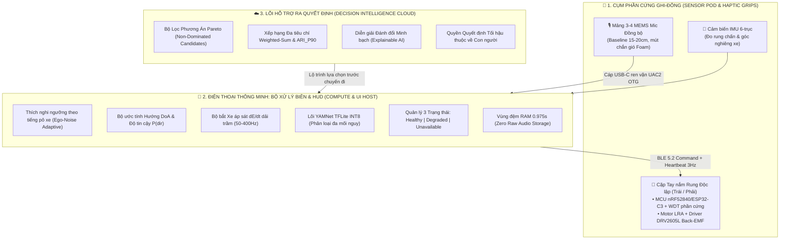

<div align="center">

# 🚨 UrbanVibe: SafeRoute
### Acoustic-Aware Decision Intelligence Platform for Hearing-Impaired Urban Mobility
*Hệ thống Trí tuệ Hỗ trợ Ra Quyết định Di chuyển An toàn Dựa trên Dữ liệu Âm thanh Đô thị dành cho Người Khiếm thính*

---

[](https://github.com/linh-nguyen123/UrbanVibe-MLAI2026)
[-FF6F00.svg?style=for-the-badge&logo=target&logoColor=white)](https://www.tmasolutions.vn/)
[](https://www.python.org/)
[-2ea44f.svg?style=for-the-badge&logo=tensorflow&logoColor=white)](https://tfhub.dev/google/yamnet/1)
[](https://streamlit.io/)
[](LICENSE)

<br/>

[Tổng quan Giải pháp](#-1-đặt-vấn-đề--tuyên-ngôn-cốt-lõi) •
[Quy trình Ra quyết định](#-2-quy-trình-ra-quyết-định-đa-tiêu-chí-mcda) •
[Tính năng Cốt lõi](#-3-tính-năng-cốt-lõi-key-features) •
[Kiến trúc Hệ thống](#-4-kiến-trúc-hệ-thống-v25) •
[Hồ sơ Kỹ thuật Docs](#-tài-liệu-kỹ-thuật-chi-tiết) •
[Cài đặt & Khởi chạy](#-7-hướng-dẫn-cài-đặt--khởi-chạy-quickstart)

</div>

---

## 📌 Tài liệu Kỹ thuật Chi tiết
> 📖 **Hồ sơ Đặc tả Chốt cho Triển khai MVP (Golden Master Specification):**  
> Xem tài liệu phản biện chuyên sâu và kiến trúc hoàn chỉnh tại: [`docs/URBANVIBE_V2_EXPERT_REVIEW_PACKAGE.md`](docs/URBANVIBE_V2_EXPERT_REVIEW_PACKAGE.md)

---

## 📖 Mục lục
- [1. Đặt vấn đề & Tuyên ngôn cốt lõi](#-1-đặt-vấn-đề--tuyên-ngôn-cốt-lõi)
- [2. Quy trình Ra quyết định Đa tiêu chí (MCDA)](#-2-quy-trình-ra-quyết-định-đa-tiêu-chí-mcda)
- [3. Tính năng cốt lõi](#-3-tính-năng-cốt-lõi-key-features)
- [4. Kiến trúc hệ thống v2.5](#-4-kiến-trúc-hệ-thống-v25)
- [5. Thông số kỹ thuật & Thiết kế phần cứng](#-5-thông-số-kỹ-thuật--bảng-bom-phần-cứng)
- [6. Cấu trúc thư mục](#-6-cấu-trúc-thư-mục-repository-structure)
- [7. Hướng dẫn cài đặt & Khởi chạy](#-7-hướng-dẫn-cài-đặt--khởi-chạy-quickstart)
- [8. Kịch bản Demo dành cho Ban Giám Khảo TMA](#-8-kịch-bản-demo-dành-cho-ban-giám-khảo-tma-solutions)
- [9. Lộ trình phát triển](#-9-lộ-trình-phát-triển-roadmap)
- [10. Giấy phép & Đội ngũ](#-10-giấy-phép--đội-ngũ-thực-hiện)

---

## 📌 1. Đặt vấn đề & Tuyên ngôn cốt lõi

### 1.1. Bối cảnh
Tại Việt Nam, có hơn **2.5 triệu người khiếm thính và suy giảm thính lực**. Trong điều kiện giao thông xe máy hỗn hợp phức tạp:
* **Còi xe, còi xe ưu tiên và tiếng gầm rú của xe tải lớn, xe ben, xe buýt** là tín hiệu cảnh báo va chạm sống còn. Người khiếm thính gần như mất hoàn toàn khả năng nhận diện mối nguy hiểm này từ phía sau.
* **Khoảng trống của các bản đồ số hiện tại (Google Maps, Vietmap):** Chỉ tối ưu hóa *Tốc độ nhanh nhất* hoặc *Khoảng cách ngắn nhất*, hoàn toàn "mù" về rủi ro âm thanh và còi xe. Các nền tảng này thường vô tình hướng người khiếm thính vào các nút giao hỗn loạn nguy hiểm.

### 1.2. Tuyên ngôn Dự án (Core Value Proposition)
> **"Chúng tôi không hứa thay thế quan sát giao thông bằng mắt; chúng tôi biến rủi ro âm thanh, độ bất định dữ liệu không gian và sở thích cá nhân thành quyết định lộ trình minh bạch, có thể giải thích và đo kiểm được dành cho người khiếm thính."**

**UrbanVibe: SafeRoute** vận hành theo mô hình **Trí tuệ Nhân tạo 2 Pha (Dual-Phase System)**:
1. **Pha 1: Trước chuyến đi (Pre-Trip Decision Intelligence):** Hỗ trợ người dùng phân tích kịch bản đánh đổi giữa *Thời gian di chuyển* $\leftrightarrow$ *Chỉ số Rủi ro Âm thanh (ARI)* để chủ động chọn lộ trình an toàn nhất.
2. **Pha 2: Trong chuyến đi (On-Trip Edge-AI Safeguard):** Vận hành ngoại tuyến 100% trên xe, phân tích hướng âm (DoA) và hiệu ứng xe áp sát (Looming), kích hoạt cảnh báo rung phản xạ Haptic phân vùng Trái/Phải để bảo vệ người lái theo thời gian thực.

---

## ⚖️ 2. Quy trình Ra quyết định Đa tiêu chí (MCDA)

Hệ thống tuân thủ chặt chẽ nguyên lý ra quyết định có đánh đổi:

```
[BƯỚC 1: LỌC TẬP PHƯƠNG ÁN PARETO (PARETO FRONTIER FILTER)]
Loại bỏ các tuyến đường "vừa chậm hơn, vừa có mức rủi ro cao hơn, vừa bất định hơn" tuyến khác.
Áp dụng điều kiện tiên quyết: ARI_max ≤ τ_cutoff (Loại bỏ các tuyến có đoạn rủi ro vượt ngưỡng cắt hiệu chuẩn).
                        │
                        ▼
[BƯỚC 2: XẾP HẠNG MCDA TRỌNG SỐ (WEIGHTED-SUM & LENGTH-WEIGHTED P90)]
Áp dụng vector trọng số do người dùng chủ động lựa chọn: W = [w_time, w_ari, w_uncertainty]
với w_time + w_ari + w_uncertainty = 1, w_i ≥ 0
(Người dùng chọn qua 3 Preset: "Ưu tiên An toàn", "Cân bằng", "Ưu tiên Thời gian" hoặc slider tùy chỉnh)
                        │
                        ▼
[BƯỚC 3: GIẢI THÍCH ĐÁNH ĐỔI MINH BẠCH (XAI) & QUYỀN CHỦ ĐỘNG CON NGƯỜI]
Hệ thống hiển thị ma trận đánh đổi định lượng:
"Tuyến B dự kiến tốn thêm 7 phút nhưng giảm 82% mức rủi ro âm thanh và tránh các đoạn có mật độ xe tải cao."
Người dùng tự tay bấm chọn và xác nhận lộ trình trước khi xuất phát.
```

### Ma trận 3 Kịch bản Minh bạch (Trade-Off Matrix)

| Tiêu chí Đánh đổi | Kịch bản A (Nhanh nhất - Baseline) | Kịch bản B (SafeRoute - Khuyên dùng) | Kịch bản C (Đa phương thức Transit) |
| :--- | :---: | :---: | :---: |
| **Thời gian di chuyển** | **20 phút** (Nhanh nhất) | 27 phút (+7 phút) | 38 phút (+18 phút) |
| **Mức Rủi ro Tuyến ($\overline{ARI}$)** | 8.5 / 10 (Rất cao) | **1.8 / 10 (Giảm 82%)** | **0.5 / 10 (Thấp nhất)** |
| **Ngưỡng Đỉnh $ARI_{P90}$** | 9.8 / 10 (Cực nguy hiểm) | **3.2 / 10 (Đã kiểm soát)** | 0.8 / 10 (Rất êm dịu) |
| **Mật độ phơi nhiễm xe tải** | 22 lượt xe lớn / chuyến | 3 lượt xe lớn / chuyến | 0 (Đi trong khoang Metro/Bus) |
| **Khuyến nghị AI (XAI)** | ⚠️ *Nhiều điểm đen xe tải* | ⭐ **KHUYẾN NGHỊ TỐI ƯU CÂN BẰNG** | Thích hợp giờ cao điểm mưa gió |

---

## ✨ 3. Tính năng cốt lõi (Key Features)

| Tính năng | Mô tả chi tiết |
| :--- | :--- |
| 🧠 **Hỗ trợ Ra quyết định Lộ trình (MCDA)** | Cân đối tối ưu giữa thời gian và rủi ro âm thanh thông qua hàm chi phí kết hợp bách phân vị $ARI_{P90}$. |
| 🚛 **Phân loại Đa Mối nguy Giao thông** | Nhận diện còi xe máy, còi ô tô, còi hơi xe tải, tiếng phanh hơi xe buýt (`Air brake`) và xe ưu tiên (`Ambulance/Fire engine`). |
| 🧭 **Bắt Hướng Âm thanh (DoA) & Xe Áp sát (Looming)** | Mảng micro ngang kết hợp TDoA phân định hướng Trái/Phải; thuật toán đạo hàm dải trầm $\frac{dE}{dt}$ bắt xe tải lao tới áp sát. |
| 📳 **Rung Xúc giác Có Điều kiện (Confidence-Gated)** | Chỉ rung phân vùng 1 bên khi $P \ge 80\%$; rung đồng thời 2 bên cảnh báo khi hướng mơ hồ. Ngắt ưu tiên (Preemption) cho sự cố tối khẩn. |
| 🛡️ **Watchdog Độc lập & Chống Lỗi Im lặng** | Từng tay nắm có MCU chạy Watchdog riêng, tự rung báo lỗi khi mất kết nối BLE. Không pop-up màn hình khi xe đang chạy. |
| 🔒 **Bảo mật 100% Zero-Storage trên RAM** | Luồng âm thanh tự hủy sau 0.975s trên RAM, không ghi âm thô, xóa dữ liệu ẩn danh bằng HMAC Deletion Token theo Nghị định 13/2023/NĐ-CP. |

---

## 🏗️ 4. Kiến trúc hệ thống v2.5



---

## 📊 5. Thông số kỹ thuật & Bảng BOM phần cứng

### 5.1. Dự toán BOM Linh kiện Chế tạo Mẫu Prototype

| Hạng mục Linh kiện | Thông số Kỹ thuật & Model | Đơn giá ước tính |
| :--- | :--- | :---: |
| **Mảng 3x MEMS Micro** | Knowles SPH0645 / ST MP34DT01 (PDM/I2S, SNR 65dB, bọc mút lọc gió) | ~120.000 VNĐ |
| **MCU Cụm Cảm biến Pod** | ESP32-S3 (Giải mã PDM/I2S + USB Audio Class 2.0 UAC2 OTG) | ~95.000 VNĐ |
| **Cảm biến Chuyển động** | IMU 6-trục MPU-6050 (Đo rung chấn ghi-đông & gia tốc xe) | ~35.000 VNĐ |
| **2x MCU Tay nắm Rung** | nRF52840 / ESP32-C3 Mini (BLE 5.2 tích hợp phần cứng Watchdog riêng) | ~160.000 VNĐ |
| **2x Động cơ Rung & Driver**| Motor LRA Coin Motor + IC Driver TI DRV2605L đo Back-EMF | ~160.000 VNĐ |
| **2x Gia tốc kế & Pin sạc** | Cảm biến LIS3DHTR kiểm tra rung vòng kín + Pin LiPo 500mAh có BMS | ~140.000 VNĐ |
| **Phụ kiện, Cáp & Vỏ IP65** | Cáp Type-C ren vặn chống tuột, mút chắn gió, kẹp nhôm CNC, đệm silicon | ~240.000 VNĐ |
| **DỰ TOÁN BOM LINH KIỆN LÕI** | *(Các module điện tử rời)* | **~950.000 VNĐ** |
| **TỔNG CHI PHÍ HOÀN CHỈNH** | **Gồm gia công 3 mạch PCB 2 lớp, vỏ in 3D PETG IP65 và công lắp ráp** | **~1.550.000 VNĐ** |

* **Khối lượng:** Cụm Pod trên ghi-đông: **$82\,\text{g}$**; Mỗi bên tay nắm rung: **$44\,\text{g}$**.
* **Thời lượng pin tay nắm:** Đo đạc thực nghiệm đạt **$> 8.5$ giờ** hoạt động liên tục.

---

## 📁 6. Cấu trúc thư mục (Repository Structure)

```text
UrbanVibe-MLAI2026/
├── data_contract.py                    # [Core] Định nghĩa DetectionPayload & RouteScenario
├── requirements.txt                    # [Config] Danh sách thư viện phụ thuộc
├── README.md                           # [Docs] Tài liệu dự án chính
│
├── docs/                               # [Specs] Tài liệu Kiến trúc & Hồ sơ Kỹ thuật
│   └── URBANVIBE_V2_EXPERT_REVIEW_PACKAGE.md # Bản Đặc Tả Chốt Cho Triển Khai MVP v2.5
│
├── engine/                             # [Backend] Xử lý âm thanh, AI & Ra quyết định
│   ├── __init__.py
│   ├── audio_stream.py                 # Worker thu âm đa luồng từ microphone/UAC2
│   ├── dsp_filter.py                   # Đo Decibel SPL, RMS, Bandpass & Looming dE/dt
│   ├── model_inference.py              # Lõi suy luận YAMNet TFLite INT8 đa mối nguy
│   └── haptic_controller.py            # Điều khiển rung phân vùng (Web API & BLE Driver)
│
├── ui/                                 # [Frontend] Giao diện người dùng Streamlit
│   ├── __init__.py
│   ├── app.py                          # Streamlit Dashboard (Decision Map & Real-time HUD)
│   └── mock_engine.py                  # Bộ giả lập luồng tín hiệu (dùng để test độc lập)
│
└── tests/                              # [Testing] Kiểm thử & Mẫu âm thanh thực nghiệm
```

---

## 🚀 7. Hướng dẫn cài đặt & Khởi chạy (Quickstart)

### Yêu cầu tiên quyết
* Hệ điều hành: Windows 10/11, macOS, hoặc Linux (Ubuntu / Raspberry Pi OS).
* Python 3.10 trở lên.

### Cài đặt môi trường
```bash
git clone https://github.com/linh-nguyen123/UrbanVibe-MLAI2026.git
cd UrbanVibe-MLAI2026

# Khởi tạo và kích hoạt môi trường ảo
python -m venv venv
.\venv\Scripts\Activate.ps1   # Trên Windows PowerShell
# source venv/bin/activate    # Trên Linux/macOS

# Cài đặt thư viện phụ thuộc
pip install -r requirements.txt
```

### Khởi chạy ứng dụng
```bash
# Chạy Dashboard Streamlit (Giao diện Ra quyết định Lộ trình & Giám sát An toàn)
streamlit run ui/app.py
```

---

## 🧪 8. Kịch bản Demo dành cho Ban Giám Khảo TMA Solutions

Kịch bản demo được thiết kế chuẩn mực 5 phút dành cho Hội đồng Giám khảo:

```
[Phút 00 - 02: PHA 1 - HỖ TRỢ RA QUYẾT ĐỊNH LỘ TRÌNH (PRE-TRIP)]
  1. Người dùng chọn điểm đi (ĐH Bách Khoa) - điểm đến (Bến xe Miền Đông) và hồ sơ thính lực.
  2. Hệ thống chạy thuật toán Pareto & MCDA, hiển thị Ma trận Đánh đổi giữa 3 kịch bản:
     👉 Tuyến A: Nhanh nhất (20 phút), nhưng ARI = 8.5 (Trục đường nhiều xe tải ben).
     👉 Tuyến B (SafeRoute khuyên dùng): 27 phút (+7 phút), ARI = 1.8 (Giảm 82% rủi ro âm thanh).
  3. Module XAI giải thích lý do đánh đổi minh bạch. Người dùng bấm "XÁC NHẬN CHỌN TUYẾN B".

[Phút 02 - 04: PHA 2 - GIÁM SÁT AN TOÀN TRÊN XE (ON-TRIP EDGE SAFEGUARD)]
  4. Hệ thống chuyển sang màn hình HUD giám sát thời gian thực (Trạng thái HEALTHY).
  5. Phát âm thanh còi xe máy ➔ Tay nắm rung 2 nhịp dứt khoát bên hướng xe tiếp cận.
  6. Phát âm thanh xe tải/xe buýt áp sát ➔ Rung dồn dập + Chớp viền HUD cảnh báo nguy cấp.

[Phút 04 - 05: CƠ CHẾ FAIL-SAFE & GIẢM THIỂU AN TOÀN GIẢ]
  7. Giả lập ngắt kết nối BLE ➔ Watchdog độc lập trên tay nắm tự động rung 3 nhịp báo mất liên kết.
  8. Màn hình HUD chuyển ngay sang trạng thái UNAVAILABLE, bảo đảm không tạo cảm giác an toàn giả.
```

---

## 🗺️ 9. Lộ trình phát triển (Roadmap)

* [x] **Mốc 1 (Kiến trúc & Đóng khung Đặc tả):** Hoàn thành tài liệu kiến trúc v2.5 được chuyên gia thẩm định độc lập thông qua.
* [ ] **Mốc 2 (Technical Spike Phần cứng):** Kiểm chứng thu nhận PCM 3 kênh đồng bộ qua UAC2 trên ESP32-S3 và kết nối BLE tay nắm rung.
* [ ] **Mốc 3 (Web Decision Engine):** Hoàn thiện module tính toán kịch bản Pareto & giao diện Streamlit hiển thị ma trận đánh đổi.
* [ ] **Mốc 4 (Thu thập VATD Pilot):** Thu thập 2.500 mẫu âm thanh giao thông thực địa tại TP.HCM để đánh giá mô hình.
* [ ] **Mốc 5 (Usability Study):** Thử nghiệm khả dụng thăm dò với 3–5 người khiếm thính trong sa bàn khép kín tại ĐH Bách Khoa CS2.

---

## 📄 10. Giấy phép & Đội ngũ thực hiện

* **Bản quyền:** Mã nguồn được phân phối dưới giấy phép [MIT License](LICENSE).
* **Đội thi:** Thành viên đội dự thi **MLAI Hackathon 2026** – Track: *Decision Intelligence Challenge (TMA Solutions)*, Trường Đại học Bách Khoa – ĐHQG TP.HCM.
* **Liên hệ & Đóng góp:** Mọi ý kiến đóng góp xin vui lòng mở [GitHub Issue](https://github.com/linh-nguyen123/UrbanVibe-MLAI2026/issues) hoặc gửi Pull Request.
