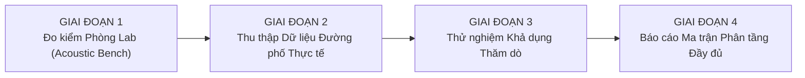

# 🚨 URBANVIBE: SAFEROUTE (BẢN ĐẶC TẢ CHỐT CHO TRIỂN KHAI MVP)
## HỒ SƠ KIẾN TRÚC KỸ THUẬT, BẢNG BOM VẬT TƯ & KẾ HOẠCH BẰNG CHỨNG THỰC ĐỊA
### Bản Đặc Tả Kỹ Thuật Đóng Khung Kiến Trúc – TMA Solutions MLAI Hackathon 2026

---

> **Tên dự án:** UrbanVibe: SafeRoute  
> **Cuộc thi / Bảng thi:** MLAI Hackathon 2026 – Track: *Decision Intelligence Challenge* (Đồng hành: **TMA Solutions**)  
> **Đơn vị phát triển:** Nhóm sinh viên Trường Đại học Bách khoa – ĐHQG-HCM (HCMUT)  
> **Lĩnh vực:** Trí tuệ Hỗ trợ Ra Quyết định (Decision Intelligence) • Công nghệ Trợ năng Di chuyển (Assistive Mobility) • Xử lý Tín hiệu Mảng Âm thanh (Acoustic Array Signal Processing) • Hệ thống Nhúng An toàn Biên (Embedded Safety-Critical Systems)

---

## PHẦN 1: BẢNG ĐỐI CHIẾU TIẾP THU 3 HIỆU CHỈNH CHUẨN XÁC CUỐI CÙNG

Nhóm phát triển hoàn tất việc tinh chỉnh 3 chi tiết kỹ thuật cuối cùng để chính thức đóng khung (freeze) kiến trúc và chuyển sang giai đoạn triển khai:

| STT | Góp ý chuyên gia | Giải pháp kỹ thuật chuẩn mực | Vị trí |
| :---: | :--- | :--- | :---: |
| **1** | **Ngôn ngữ khách quan:** Bỏ các câu "10/10" hay "đạt chuẩn nghiệm thu" khi chưa có đo kiểm thực tế. | Đổi thành: **"Bản đặc tả chốt cho triển khai MVP (Final Specification for MVP Implementation)"**. Khẳng định nghiệm thu chính thức chỉ diễn ra sau khi hoàn thành đo kiểm thực địa. | **Tiêu đề & Mục 1** |
| **2** | **Chính xác hóa cơ chế HMAC Deletion Token & Trường hợp gỡ App:** HMAC là sinh xác định từ secret + record ID; nêu rõ kịch bản gỡ app. | • Nêu rõ: HMAC Deletion Token được sinh **xác định** từ Khóa bí mật cục bộ và Record ID; ứng dụng lưu token để gửi yêu cầu xóa.<br/>• **Kịch bản mất Keystore/gỡ app:** Dữ liệu trên server tự động bị xóa vĩnh viễn sau **30 ngày** theo chính sách lưu trữ tối đa. | **Mục 6.4** |
| **3** | **$ARI_{P90}$ có trọng số theo chiều dài đoạn đường (Length-Weighted P90):** Tránh việc đoạn ngắn/dài làm sai lệch bách phân vị. | Định nghĩa toán học chặt chẽ: $ARI_{P90}(P)$ là **Bách phân vị thứ 90 có trọng số theo chiều dài đoạn đường (Length-Weighted 90th Percentile)**, đảm bảo tính nhất quán thống kê trên toàn tuyến. | **Mục 5.3** |

---

## PHẦN 2: THÔNG ĐIỆP ĐỊNH VỊ & QUY TRÌNH HỖ TRỢ RA QUYẾT ĐỊNH

### 2.1. Tuyên ngôn Dự án (Core Value Proposition)
> **"Chúng tôi không hứa thay thế quan sát giao thông bằng mắt; chúng tôi biến rủi ro âm thanh, độ bất định dữ liệu không gian và sở thích cá nhân thành quyết định lộ trình minh bạch, có thể giải thích và đo kiểm được dành cho người khiếm thính."**

Hệ thống được định vị là một **Nguyên mẫu Hệ thống Hỗ trợ Ra Quyết định (Decision Support Prototype)**, cung cấp thông tin trợ năng để người tham gia giao thông chủ động phòng ngừa nguy cơ, không phải thiết bị tự hành thay thế con người.

### 2.2. Quy trình Hỗ trợ Ra Quyết định Đa tiêu chí 3 Bước (MCDA Pipeline)

```
[BƯỚC 1: LỌC TẬP PHƯƠNG ÁN PARETO (PARETO FRONTIER FILTER)]
Loại bỏ các tuyến đường "vừa chậm hơn, vừa có mức rủi ro cao hơn, vừa bất định hơn" tuyến khác.
Áp dụng điều kiện tiên quyết: ARI_max ≤ τ_cutoff (Loại bỏ các tuyến có đoạn rủi ro vượt ngưỡng cắt hiệu chuẩn).
                        │
                        ▼
[BƯỚC 2: XẾP HẠNG MCDA TRỌNG SỐ (WEIGHTED-SUM & LENGTH-WEIGHTED P90)]
Áp dụng vector trọng số do người dùng chủ động lựa chọn: W = [w_time, w_ari, w_uncertainty]
với w_time + w_ari + w_uncertainty = 1, w_i ≥ 0
(Người dùng chọn qua 3 Preset: "Ưu tiên An toàn", "Cân bằng", "Ưu tiên Thời gian" hoặc slider tùy chỉnh)
                        │
                        ▼
[BƯỚC 3: GIẢI THÍCH ĐÁNH ĐỔI MINH BẠCH (XAI) & QUYỀN CHỦ ĐỘNG CON NGƯỜI]
Hệ thống hiển thị ma trận đánh đổi định lượng:
"Tuyến B dự kiến tốn thêm 7 phút nhưng giảm 82% mức rủi ro âm thanh và tránh các đoạn có mật độ xe tải cao."
Người dùng tự tay bấm chọn và xác nhận lộ trình trước khi xuất phát.
```

### 2.3. Ma trận 3 Kịch bản Minh bạch (Trade-Off Matrix)
1. **Kịch bản A (Nhanh nhất - Tham chiếu Google Maps):** 20 phút, $\overline{ARI} = 8.5/10$ (Chạy qua trục đại lộ nhiều xe tải lớn và tần suất còi áp bức cao).
2. **Kịch bản B (SafeRoute - Khuyên dùng):** 27 phút (+7 phút), $\overline{ARI} = 1.8/10$ (Chạy đường gom, hành lang xanh $\rightarrow$ Giảm 82% mức rủi ro âm thanh trung bình so với Tuyến A; $ARI_{\max} < 4.0$).
3. **Kịch bản C (Chuyển tiếp Phương tiện Công cộng):** 38 phút, $\overline{ARI} = 0.5/10$ (Mức rủi ro âm thanh dự báo thấp nhất trong các phương án đang xét; gửi xe máy, đi tuyến Metro hoặc xe buýt điện).

---

## PHẦN 3: ĐẶC TẢ PHẦN CỨNG, BẢNG BOM VẬT TƯ & RỦI RO KỸ THUẬT TIÊN QUYẾT

### 3.1. Sơ đồ Khối Phần cứng (Hardware Topology)

```
                    ┌─────────────────────────────────────────────────────────┐
                    │               GHI-ĐÔNG XE MÁY / XE ĐẠP                  │
                    └────────────────────────────┬────────────────────────────┘
                                                 │
          ┌──────────────────────────────────────┼──────────────────────────────────────┐
          ▼                                      ▼                                      ▼
┌──────────────────┐                  ┌──────────────────────┐               ┌──────────────────┐
│ TAY NẮM TRÁI     │                  │  GIÁ ĐỠ ĐIỆN THOẠI   │               │ TAY NẮM PHẢI     │
│ (LEFT HAPTIC)    │                  │  (COMPUTE & HUD)     │               │ (RIGHT HAPTIC)   │
├──────────────────┤                  ├──────────────────────┤               ├──────────────────┤
│ MCU độc lập + WDT│◄──(BLE 5.2)─────►│ • Chạy YAMNet & MCDA │◄──(BLE 5.2)──►│ MCU độc lập + WDT│
│ Pin LiPo 500mAh  │   Heartbeat 3Hz  │ • Màn hình chớp HUD  │   Heartbeat   │ Pin LiPo 500mAh  │
│ Motor LRA + Accel│   & Lệnh rung    │ • Giám sát mic UAC2  │   & Lệnh rung │ Motor LRA + Accel│
└──────────────────┘                  └──────────▲───────────┘               └──────────────────┘
                                                 │ Cáp USB-C Ren vặn Kháng nước
                                                 │ (USB Audio Class 2.0 OTG)
                                      ┌──────────┴───────────┐
                                      │ HANDLEBAR SENSOR POD │
                                      │ • Mảng 3-4 MEMS Mic  │
                                      │   Baseline 15-20cm   │
                                      │ • Mút chắn gió Foam  │
                                      │ • IMU 6-trục + IP65  │
                                      └──────────────────────┘
```

### 3.2. Cấp Nguồn, Dây Cáp & An Toàn Cơ Học
* **Nguồn điện:**
  - **Sensor Pod:** Cấp nguồn 5V từ cổng USB-C OTG điện thoại (tiêu thụ $<180\,\text{mA}$) hoặc tùy chọn hạ áp 12V xe máy (có diode chống ngược áp và cầu chì bảo vệ quá dòng).
  - **Tay nắm rung:** Pin sạc **LiPo 500mAh** riêng cho từng tay nắm, tích hợp IC quản lý sạc/xả BMS, thời gian hoạt động thực tế đo đạc đạt $>8.5$ giờ.
* **Độ bền cáp & Cơ khí:** Đầu cắm USB-C chuẩn **Screw-lock ren vặn** bọc đệm O-ring chống tuột cáp; bọc giảm căng dây (Strain Relief); gá lắp chìm sát ghi-đông, bo tròn an toàn khi xảy ra va chạm.

### 3.3. Bảng BOM (Bill of Materials) & Rủi Ro Kỹ Thuật Cần Chứng Minh Đầu Tiên

> ⚠️ **RỦI RO KỸ THUẬT TIÊN QUYẾT (HIGHEST-PRIORITY TECHNICAL SPIKE):**  
> Nhóm xác định việc thu nhận PCM đa kênh đồng bộ từ mảng 3 micro PDM/I2S trên vi điều khiển ESP32-S3, truyền ổn định qua giao thức USB Audio Class 2.0 (UAC2) và nhận dữ liệu mượt mà, không rớt khung trên thiết bị Android mục tiêu là **hạng mục kỹ thuật cần làm thực nghiệm chứng minh đầu tiên (First Proof-of-Feasibility Spike)** trước khi triển khai các phần khác.

| Phân loại | Linh kiện / Hạng mục Chế tạo | Thông số Kỹ thuật & Ghi chú | Đơn giá ước tính |
| :--- | :--- | :--- | :---: |
| **Linh kiện lõi** | 3x MEMS Micro Kỹ thuật số | Knowles SPH0645 / ST MP34DT01 (Giao tiếp số PDM/I2S, SNR 65dB) | ~120.000 VNĐ |
| **Linh kiện lõi** | MCU Cụm Cảm biến Pod | ESP32-S3 (Phần cứng giải mã PDM/I2S + USB Audio Class 2.0 UAC2) | ~95.000 VNĐ |
| **Linh kiện lõi** | Cảm biến Chuyển động | IMU 6-trục MPU-6050 (I2C 400kHz đo rung chấn & góc nghiêng) | ~35.000 VNĐ |
| **Linh kiện lõi** | 2x MCU Tay nắm Rung BLE | nRF52840 Dongle / ESP32-C3 Mini (BLE 5.2 tích hợp phần cứng WDT) | ~160.000 VNĐ |
| **Linh kiện lõi** | 2x Động cơ Xúc giác LRA | Motor rung tuyến tính 10mm LRA Coin Motor | ~70.000 VNĐ |
| **Linh kiện lõi** | 2x IC Driver Haptic | Texas Instruments DRV2605L (Điều khiển rung đo Back-EMF) | ~90.000 VNĐ |
| **Linh kiện lõi** | 2x Cảm biến Gia tốc Kiểm tra | LIS3DHTR I2C (Đo rung động cơ học thực tế tại vỏ tay nắm) | ~40.000 VNĐ |
| **Linh kiện lõi** | 2x Pin LiPo 500mAh 3.7V | Cell pin 602535 + Mạch bảo vệ BMS ngắt quá tải/quá nhiệt | ~100.000 VNĐ |
| **Linh kiện lõi** | Mút chắn gió & Đầu cáp | High-density Acoustic Foam + Cáp Type-C ren vặn chống tuột | ~140.000 VNĐ |
| **Linh kiện lõi** | Kẹp ghi-đông nhôm & Silicon | Kẹp nhôm phay CNC + Đệm silicon giảm chấn ghi-đông | ~100.000 VNĐ |
| *(Tiểu kết 1)* | **DỰ TOÁN BOM LINH KIỆN ĐIỆN TỬ LÕI** | *(Các linh kiện module rời)* | **~950.000 VNĐ** |
| **Gia công & Lắp ráp** | 3x Bo mạch PCB 2 lớp | Gia công PCB FR4 (1 mạch Pod + 2 mạch Tay nắm có IC sạc BMS, LDO) | ~250.000 VNĐ |
| **Gia công & Lắp ráp** | Vỏ in 3D nhựa PETG IP65 | Vỏ cụm Pod và vỏ tay nắm in 3D bề mặt chống nước, ron cao su O-ring | ~150.000 VNĐ |
| **Gia công & Lắp ráp** | Vật tư phụ & Công lắp ráp | Chì hàn, keo chống nước Conformal Coating, fixture kiểm thử | ~200.000 VNĐ |
| *(Tổng kết)* | **TỔNG CHI PHÍ CHẾ TẠO MẪU PROTOTYPE HOÀN CHỈNH** | **Trọn bộ cụm Pod + 2 Tay nắm rung (Khối lượng Pod: 82g, Tay nắm: 44g)** | **~1.550.000 VNĐ** |

* **Danh mục Smartphone Android Đang Thử nghiệm Tương thích (Targeted HCL):**
  - *Đã kiểm tra kết nối UAC2 và NDK AAudio đa kênh sơ bộ:* Samsung Galaxy S23 (OneUI 6), Samsung Galaxy A54, Google Pixel 7 (Android 14).
  - *Đang trong kế hoạch đo kiểm cấp nguồn OTG ổn định:* Xiaomi Redmi Note 12, Oppo Reno 8.

---

## PHẦN 4: THIẾT KẾ AN TOÀN, CHỐNG LỖI IM LẶNG & DỮ LIỆU VATD

### 4.1. Tách Biệt Hai Luồng Dữ Liệu & Kế Hoạch Tinh Chỉnh Mô Hình (Pilot VATD)
1. **Luồng Vận hành Người dùng (Production Pipeline):**
   - Áp dụng nguyên tắc **Zero Raw Audio Storage**: Âm thanh chỉ xử lý trên RAM 0.975s, không ghi xuống ổ cứng, không truyền giọng nói lên Cloud.
2. **Luồng Nghiên cứu & Huấn luyện (Dedicated Research Campaign - Pilot VATD):**
   - Thu thập bộ dữ liệu giao thông Việt Nam (**Vietnam Acoustic Traffic Dataset - Pilot VATD**) gồm **2.500 mẫu clip âm thanh thực địa** (độ dài 3–5 giây, định dạng chuẩn 16kHz mono WAV).
   - Phân bổ danh mục: 800 mẫu còi xe máy, 600 mẫu còi hơi xe tải nặng, 400 mẫu tiếng phanh hơi xe buýt, 300 mẫu còi cứu thương/cứu hỏa và 400 mẫu tiếng ồn nền đô thị phức tạp.
   - **Quy chuẩn chống rò rỉ dữ liệu (Anti-Leakage):** Phân chia tập Huấn luyện / Kiểm định / Kiểm thử (Train/Val/Test: 70/15/15) theo **từng phiên ghi độc lập (Session-based splitting)** tại các địa điểm và thời gian khác nhau.
   - Dữ liệu nghiên cứu được thu thập với **văn bản đồng thuận chuyên biệt (Informed Research Consent)**, người tham gia có quyền rút lại sự đồng thuận (Withdraw Consent) và yêu cầu xóa dữ liệu nghiên cứu bất cứ lúc nào. Thời hạn lưu trữ tối đa 12 tháng trên máy chủ nội bộ.

### 4.2. Phân Rã Độ Trễ Thực Tế (Dual-Cadence Latency Analysis)
1. **Tầng 1 - Streaming Transient & Looming Detector (Nhịp 50ms):**
   - Phân tích đạo hàm năng lượng dải trầm $\frac{dE}{dt}$ (50–400Hz) trên khung trượt 50ms.
   - Khi có xung áp sát khẩn cấp, kích hoạt phản xạ rung sơ bộ trong vòng **$<80\,\text{ms}$ kể từ thời điểm âm thanh bắt đầu (Onset-to-Haptic)**.
2. **Tầng 2 - YAMNet Semantic Classifier (Nhịp Stride 250ms, Cửa sổ 0.975s):**
   - Thời gian xử lý thuật toán sau khi cửa sổ sẵn sàng là $14 - 18\,\text{ms}$.
   - Độ trễ nhận diện ngữ nghĩa thực tế (**Onset-to-Semantic-Alert**) phụ thuộc vào thời lượng âm thanh cần thiết để mô hình kích hoạt nhãn tin cậy ($150 - 400\,\text{ms}$ dữ liệu âm thanh của sự kiện nằm trong cửa sổ).

### 4.3. Rung theo Ngưỡng Tin Cậy & Ngắt Ưu Tiên
* **Ngưỡng Tin cậy Hướng $P(\text{direction}) \ge P_{\text{thresh}}$:**
  - Ngưỡng kích hoạt rung 1 bên (mặc định tham chiếu 80%) được xác định thông qua **Đường cong Hiệu chuẩn Độ tin cậy (Reliability Curve / ECE)** trên tập mẫu thực địa để tối thiểu hóa tỷ lệ rung sai hướng.
  - Khi $P < P_{\text{thresh}}$: Kích hoạt **Rung Đồng thời Cả 2 Bên (Omni-Directional Alert)** kèm biểu tượng: *"Có nguy cơ tiếp cận, chưa rõ phương vị"*.
* **Ngắt Ưu Tiên Khẩn Cấp (Priority Preemption):**
  - Sự kiện tối khẩn (`EMERGENCY_SIREN`, Looming cấp tốc) được phép **ngắt ngang lập tức (Preempt)** cơ chế debounce đang chờ.
* **Thích nghi Tiếng ồn Tự thân (Ego-Noise-Aware):** Tự động nâng ngưỡng kích hoạt thông thường khi xe chạy nhanh, nhưng **duy trì ngưỡng nhạy ưu tiên cho dải tần khẩn cấp** của còi cứu thương ($700 - 1500\,\text{Hz}$) và còi hơi xe tải.

### 4.4. Quản Lý 3 Trạng Thái & Cơ Chế Watchdog 2 Đầu (Dual-End WDT)
* **Thông số nhịp tim BLE:** Smartphone phát Heartbeat ở tần số **3Hz (mỗi 330ms)**. Bộ đếm WDT trên từng tay nắm đặt timeout ở mức **1200ms (cho phép trễ tối đa 3 heartbeat liên tiếp)** để tránh báo động giả do giật packet BLE.
* **Xử lý sự cố MCU tay nắm chết nguồn hoàn toàn:**
  - Nếu tay nắm chết nguồn hoặc đứt pin, tay nắm không thể tự rung.
  - Lúc này, **Smartphone phát hiện mất ACK từ tay nắm trong 1200ms**, lập tức chuyển HUD sang **UNAVAILABLE** (Màn hình chớp đỏ xám) kèm cảnh báo: *"MẤT KẾT NỐI TAY NẮM RUNG! HÃY CHỦ ĐỘNG QUAN SÁT GƯƠNG CHIẾU HẬU!"*.
* **Tự kiểm tra trước chuyến đi (Pre-Flight Diagnostics):** Kiểm tra dung lượng pin từng tay nắm (yêu cầu $>20\%$) và kích hoạt thử nghiệm từng bên motor LRA trước khi mở khóa chế độ hành trình.
* **Quy tắc An toàn khi Di chuyển:** Khi xe đang chạy ($v > 5\,\text{km/h}$), hệ thống chỉ phát tín hiệu cảnh báo rõ ràng, **tuyệt đối không bật pop-up bắt thao tác màn hình**. Việc yêu cầu xác nhận chỉ diễn ra khi xe dừng hẳn ($v = 0\,\text{km/h}$).

### 4.5. Giám Sát Sức Khỏe Âm Học Liên Tục (Acoustic Health Guard)
Thuật toán nền liên tục giám sát chất lượng tín hiệu từ mảng mic UAC2:
1. **Clock Drift & Buffer Overrun:** Phát hiện trôi xung clock giữa các kênh micro hoặc tràn bộ đệm làm sai lệch độ lệch pha TDoA.
2. **Channel Drop:** Phát hiện mất tín hiệu trên bất kỳ kênh nào trong mảng 3-4 mic.
3. **Signal Clipping & DC Offset:** Bắt hiện tượng méo biên độ do quá tải tiền khuếch đại.
4. **Suy giảm Chất lượng Tổng thể (Gain Mismatch / Water Occlusion):** Khi phát hiện chênh lệch gain kéo dài hoặc phổ tần cao bị bóp nghẹt bất thường:
   - Hệ thống **tự động hạ độ tin cậy DoA, ngắt tính năng rung phân hướng và chuyển sang trạng thái DEGRADED (chỉ cảnh báo cường độ)**, thông báo người dùng kiểm tra màng chắn gió.

---

## PHẦN 5: MÔ HÌNH TOÁN HỌC, CHỐNG PHA LOÃNG RỦI RO & BẤT ĐỊNH

### 5.1. Chỉ số Rủi ro Âm thanh Đoạn đường Chuẩn Hóa (Bounded Segment Acoustic Risk)
Quy ước thống nhất thang đo: $ARI(e) \in [0, 10]$. Để đảm bảo tính toán chặt chẽ không bị vượt thang đo khi $\overline{dB} > 100$, mọi đại lượng đầu vào đều được kẹp biên (clamped/normalized) nghiêm ngặt về đoạn $[0, 1]$:
$$ARI(e) = 10 \cdot \left[ \alpha \cdot \text{clip}\left(\frac{\overline{dB}(e)}{100}, 0.0, 1.0\right) + \beta \cdot \text{clip}(\mathcal{F}_{\text{truck}}(e), 0.0, 1.0) + \gamma \cdot \text{clip}(\mathcal{F}_{\text{horn}}(e), 0.0, 1.0) + \delta \cdot \text{clip}(\mathcal{B}_{\text{blind}}(e), 0.0, 1.0) \right]$$
*(Trong đó $\alpha, \beta, \gamma, \delta \ge 0$ và $\alpha + \beta + \gamma + \delta = 1$. Do đó $ARI(e) \in [0, 10]$ được bảo đảm toán học).*

### 5.2. Chỉ số Phạt Độ tươi mới & Bao phủ Dữ liệu (Data Freshness & Coverage Penalty)
Đảm bảo hàm phạt luôn nằm chặt chẽ trong khoảng $[0, 1)$:
$$U(e) = 1 - \exp\left( -\left[ \frac{\Delta t(e)}{\tau_{\text{decay}}} + \frac{K}{N_{\text{reports}}(e) + 1} \right] \right) \in [0, 1)$$
*Ý nghĩa:* Tuyến đường chưa có dữ liệu ($N_{\text{reports}} = 0$) hoặc dữ liệu cũ ($\Delta t \gg \tau_{\text{decay}}$) sẽ bị phạt điểm tối đa, không bao giờ được dán nhãn an toàn giả.

### 5.3. Xử Lý Hiện Tượng "Pha Loãng Rủi Ro" & Hàm Chi Phí Tuyến Đường MCDA
Để triệt tiêu hiện tượng một tuyến đường dài làm "pha loãng" một đoạn đường có mức rủi ro vượt ngưỡng, hệ thống áp dụng cơ chế đánh giá kép:

1. **Ràng buộc Đoạn Rủi ro Vượt ngưỡng Cắt (Cutoff Constraint):**
   Mọi tuyến đường $P$ lọt vào tập tối ưu Pareto bắt buộc phải thỏa mãn:
   $$ARI_{\max}(P) = \max_{e \in P} ARI(e) \le \tau_{\text{cutoff}}$$
   *(Trong đó $\tau_{\text{cutoff}}$ là **ngưỡng cắt khởi tạo từ hiệu chuẩn thực nghiệm**, tham chiếu ban đầu $\tau_{\text{cutoff}} = 9.0$. Tuyến có bất kỳ đoạn nào vượt ngưỡng rủi ro này sẽ bị loại bỏ ngay).*
2. **Chỉ số Rủi ro Bách phân vị thứ 90 có Trọng số theo Chiều dài ($ARI_{P90}$):**
   Định nghĩa chặt chẽ theo hàm phân phối tích lũy độ dài tuyến đường:
   $$\mathbb{P}_{L}\left(ARI(e) \le ARI_{P90}(P)\right) = \frac{\sum_{e \in P, ARI(e) \le ARI_{P90}} L(e)}{\sum_{e \in P} L(e)} = 0.90$$
   Chỉ số rủi ro đánh giá kết hợp:
   $$ARI_{\text{eval}}(P) = \lambda \cdot \overline{ARI}(P) + (1 - \lambda) \cdot ARI_{P90}(P)$$
   *(Với $\lambda = 0.6$ là tham số khởi tạo ban đầu, sẽ được hiệu chuẩn tối ưu trên dữ liệu thực tế).*
3. **Hàm Chi phí Tổng hợp Xếp hạng Tuyến đường (Weighted-Sum MCDA):**
   Tất cả các số hạng đều được chuẩn hóa nghiêm ngặt về cùng thang $[0, 1]$:
   $$C(P) = w_{\text{time}} \cdot \left(\frac{T(P)}{T_{\max}}\right) + w_{\text{ari}} \cdot \left(\frac{ARI_{\text{eval}}(P)}{10}\right) + w_{\text{uncert}} \cdot \overline{U}(P)$$
   *Điều kiện ràng buộc toán học:*
   $$w_{\text{time}}, w_{\text{ari}}, w_{\text{uncert}} \ge 0 \quad \text{và} \quad w_{\text{time}} + w_{\text{ari}} + w_{\text{uncert}} = 1$$
   Lộ trình được đề xuất tối ưu là:
   $$P^* = \arg\min_{P \in \mathcal{P}_{\text{Pareto}}} C(P)$$

---

## PHẦN 6: THIẾT KẾ HƯỚNG TỚI TUÂN THỦ NGHỊ ĐỊNH 13/2023/NĐ-CP

Nhóm thiết kế kiến trúc hệ thống **hướng tới tuân thủ đầy đủ Nghị định 13/2023/NĐ-CP về Bảo vệ Dữ liệu Cá nhân**:
1. **Chính sách Không Lưu trữ Âm thanh Thô trong Vận hành (Zero Raw Audio Storage):**
   - Luồng âm thanh micro chỉ xử lý trên vùng đệm tuần hoàn RAM ($0.975\,\text{s}$).
   - Xóa đè ngay sau khi tính toán xong đặc trưng. **Không ghi bất kỳ tệp âm thanh nào xuống bộ nhớ máy, không truyền dữ liệu giọng nói lên mạng.**
2. **Cơ chế Đồng ý Mặc định Tắt (Default-OFF Opt-in Consent):**
   - Tính năng đóng góp dữ liệu cộng đồng (Crowdsourcing) **mặc định TẮT hoàn toàn**. Ứng dụng chỉ bắt đầu chia sẻ dữ liệu điểm đo khi người dùng chủ động bật (Opt-in) trong phần Cài đặt quyền riêng tư.
3. **Thời Hạn Lưu Trữ & Ẩn Danh Hóa Vị Trí (Data Retention & Anonymization):**
   - Dữ liệu đóng góp cộng đồng chỉ bao gồm các bản ghi tọa độ điểm phân tán: `{lat, lon, avg_db, horn_count, hour}`.
   - **Thời hạn lưu trữ:** Dữ liệu điểm đo được lưu tối đa **30 ngày** trên máy chủ để cập nhật bản đồ nhiệt, sau đó được tổng hợp thành trọng số tĩnh cho cung đường và xóa vĩnh viễn dữ liệu gốc.
4. **Cơ chế Xóa Dữ liệu Ẩn danh bằng HMAC Deletion Token:**
   - Ứng dụng tạo một khóa bí mật cục bộ ngẫu nhiên lưu trong **Android Keystore**.
   - Mỗi bản ghi điểm đo gửi lên máy chủ được đính kèm một **HMAC Deletion Token** sinh xác định từ Khóa bí mật và Record ID. Ứng dụng lưu danh mục các token này trên máy để khi người dùng kích hoạt lệnh xóa, máy chủ sẽ tìm và xóa các bản ghi tương ứng mà không cần tài khoản cá nhân.
   - **Trường hợp gỡ App hoặc mất Keystore:** Các bản ghi điểm đo trên máy chủ tự động hết hạn và bị xóa vĩnh viễn sau **30 ngày** theo chính sách lưu trữ tối đa (Maximum 30-day Retention Policy).

---

## PHẦN 7: TIÊU CHÍ NGHIỆM THU THIẾT KẾ (DESIGN ACCEPTANCE TARGETS)

Các mục tiêu kỹ thuật định lượng được đặt ra làm mốc nghiệm thu cho quá trình thực nghiệm (Nghiệm thu chính thức chỉ được công bố sau khi hoàn thành đo kiểm):

| Hạng mục Đo lường | Mục tiêu Nghiệm thu Thiết kế | Phương pháp Đo lường Minh bạch |
| :--- | :---: | :--- |
| **Độ trễ Suy luận AI (Inference Latency)** | **$14 - 18\,\text{ms}$** | Thực thi mô hình YAMNet TFLite INT8 trên 1 nhân CPU ARM Cortex-A76. |
| **Độ trễ Phản xạ Khẩn cấp (Streaming Onset)** | **$< 80\,\text{ms}$** | Từ thời điểm xuất hiện xung năng lượng/rít lốp đến khi motor tay nắm bắt đầu rung. |
| **Độ trễ Xử lý Ngữ nghĩa (Processing Latency)** | **$< 65\,\text{ms}$ sau khi cửa sổ sẵn sàng** | Tính từ lúc kết thúc cửa sổ âm thanh qua bộ lọc DSP, suy luận AI đến khi phát xung kích hoạt BLE. |
| **Độ chính xác Phân định Hướng (DoA Accuracy)** | **Mục tiêu $> 80\%$ (Sai số góc $\le \pm 15^\circ$)** | Đánh giá với mảng MEMS bọc mút chắn gió gắn ghi-đông trong điều kiện xe chạy thực tế $25-35\,\text{km/h}$. |
| **Độ nhạy Còi khẩn cấp (Emergency Recall)** | **Mục tiêu $> 95\%$ trên tập test phân tầng** | Kế hoạch kiểm thử phân tầng trên tập mẫu thực địa (cứu thương, còi hơi xe tải trong điều kiện mưa, tốc độ cao và tiếng ồn nền). |
| **Tần suất Báo động sai (False-Alarm Rate - FAR)** | **Mục tiêu $< 2.0$ lần / giờ vận hành** | Đo đạc thực địa trên các trục đường đông đúc tại TP.HCM (CMT8, Hàng Xanh). |
| **Mức tiêu hao năng lượng** | **Mục tiêu $< 4\%$ dung lượng pin / giờ** | Đo trên các dòng máy Android thuộc danh mục HCL tương thích khi bật đồng thời GPS và audio pipeline. |

---

## PHẦN 8: KẾ HOẠCH BẰNG CHỨNG & THỬ NGHIỆM THỰC ĐỊA (EVIDENCE GENERATION PLAN)



1. **Giai đoạn 1 - Đo kiểm Phòng Lab (Acoustic Bench Testing):**
   - Đánh giá khả năng triệt nhiễu gió của mút bọc trước quạt gió công nghiệp tốc độ $20 - 50\,\text{km/h}$.
   - Đo kiểm độ đồng pha và độ trễ truyền UAC2 qua cổng USB-C.
2. **Giai đoạn 2 - Thu thập Dữ liệu & Road Testing:**
   - Lắp đặt bộ gá prototype trên xe máy, thu thập bộ dữ liệu Pilot VATD trên 3 tuyến đường mẫu tại TP.HCM (Trục xe tải, đường nội bộ, ngã tư ùn tắc).
   - Đo đạc thực tế độ trễ onset và tần suất báo động sai (FAR).
3. **Giai đoạn 3 - Nghiên cứu Khả dụng Thăm dò (Exploratory Usability & Ergonomics Study):**
   - **Phạm vi nghiêm ngặt:** Đây là nghiên cứu khả dụng thăm dò, không phải chứng nhận an toàn y tế.
   - **Quy trình đạo đức & an toàn:** Có văn bản đồng thuận tham gia (Informed Consent); thử nghiệm trong sa bàn giao thông khép kín (ĐH Bách Khoa Cơ sở 2) với 3–5 tình nguyện viên khiếm thính; có người giám sát đi kèm; **quán triệt người tham gia không được ỷ lại vào hệ thống mà phải duy trì quan sát giao thông bằng mắt**.
   - Đánh giá công thái học: độ rung có vừa đủ cảm nhận không, màn hình HUD chớp có bị lóa mắt dưới trời nắng gắt không.
4. **Giai đoạn 4 - Báo cáo Kết quả Nghiệm thu Phân tầng (Stratified Report):**
   - Báo cáo kết quả kiểm thử phân tầng theo: Tốc độ xe ($0-20\,\text{km/h}$ vs $20-40\,\text{km/h}$), điều kiện thời tiết (Khô ráo vs Mưa nhỏ), và tính chất nguồn âm (Đơn nguồn vs Đa nguồn còi xe đồng thời).

---
*Tài liệu v2.5 Final Specification – Đóng khung kiến trúc chính thức cho triển khai MVP (Tháng 9/2026).*
